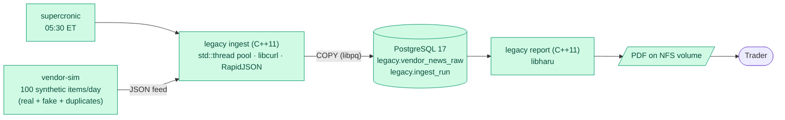
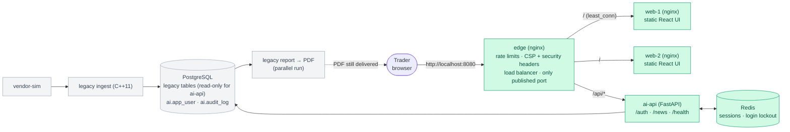
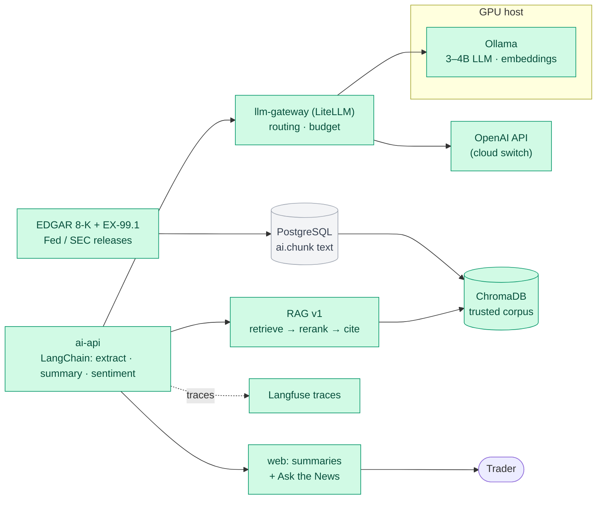
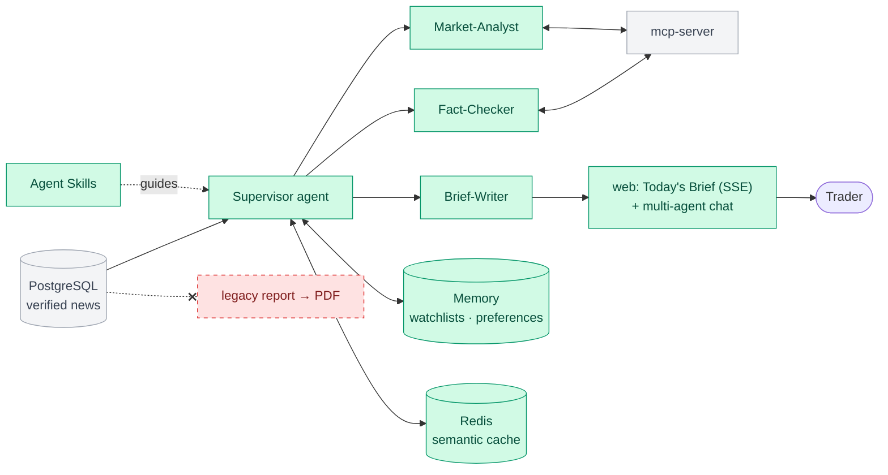

# premarket-ai

AI pre-market news platform that separates real market news from fake. It migrates a legacy **C++11 / PostgreSQL / PDF** pipeline, step by step, to **modern C++20, RAG, LangGraph agents, MCP, Skills and local LLMs** (with an OpenAI / Claude / Gemini switch), all running on **Podman**.

> ⚠️ **Simulation, not investment advice.** All vendor news in this project is **synthetic**: it's generated, labeled `[SYNTHETIC]`, and fake sources use reserved `.example` / `.test` domains. The system is decision support only. It never recommends buying or selling and has no trading tools.

## The story
Before the market opens, traders read a news report. For years it came from a **batch pipeline**: an external vendor sends ~100 news items per day, a C++ program loads them into PostgreSQL, and another C++ program prints a **PDF** onto an NFS share.

The vendor is paid for 100 items per day, so it **pads the feed with duplicates, stale stories, fake news and even fake companies**. After a conference, the CEO asked for a modern website and for AI that can tell traders **which news is real**.

This repo rebuilds the system **one increment at a time** (the strangler-fig pattern). Every increment ships something traders can use and replaces one piece of the legacy system, until the PDF is retired.

## Delivery increments
Each increment is developed on its own branch, merged to `main` through a PR once its "done when" check passes, and tagged (`inc-0`, `inc-1`, …) so every stage can be checked out exactly as it was.

| # | branch_name | Traders get |
|---|---|---|
| 0 | `inc-0-legacy-baseline` | The PDF report, as today (the "before") |
| 1 | `inc-1-web-instead-of-pdf` | A news feed **website** instead of the PDF, no AI yet |
| 2 | `inc-2-rule-based-checks` | **FAKE COMPANY / DUPLICATE / STALE / SPOOFED SOURCE** badges from rules, no LLM |
| 3 | `inc-3-first-ai` | AI **summaries, sentiment** and **"Ask the News"** chat with cited sources |
| 4 | `inc-4-ai-verification` | **4 verdicts** (VERIFIED / UNVERIFIED / MISLEADING / FAKE) with evidence, plus an analyst **review queue** |
| 5 | `inc-5-agents-and-skills` | The **pre-market brief** and multi-agent chat. **The PDF is retired.** |
| 6 | `inc-6-production` | A reliable brief **before 07:30 ET** every trading day, alerts, and the vendor scorecard |
| 7 | `inc-7-enterprise-cloud-theory` | *(Theory only)* How a large enterprise would build the same platform on **Azure, AWS and GCP** |

## This branch: increment 1, web instead of PDF
Traders read the day's news on a **website** instead of the PDF. There's no AI yet. The legacy pipeline from increment 0 keeps running unchanged, and the PDF is still produced every day (a parallel run), so traders can compare.
- **web** (React + Vite + TypeScript, TanStack Query, Tailwind + shadcn/ui): login, a News Feed per trading date (filters for date, ticker, text search and duplicates, all in the URL, plus keyboard navigation) and a News detail page with the source link. The **SIMULATION** ribbon and the "Decision support only, not investment advice" banner are on every page. It's built as static files and served by **two nginx replicas** (`web-1`, `web-2`).
- **ai-api** (Python 3.13, FastAPI) reads the legacy tables read-only and serves `/auth/login`, `/auth/refresh`, `/auth/logout`, `/news`, `/news/{id}` and `/health`. Users have one of three roles (TRADER, ANALYST, ADMIN) and argon2id password hashes, and the demo users are seeded at start-up.
- **edge** (nginx) is the only published port. It load balances the two web replicas, proxies `/api/*` to ai-api, and applies the rate limits and security headers.
- **redis** holds login sessions and failed-login counters: temporary state only, never persisted.
- The feed shows the same stories as the PDF: duplicates are hidden by default, and a "Show duplicates" switch brings them back, marked.

### Security
Even though this is a demo, the website is built the way a production internal site should be. Each layer assumes the one in front of it can fail.

| Layer | Protection |
|---|---|
| **Edge proxy** (nginx) | The only published port, bound to `127.0.0.1` by default. Rate limits per client: login 10/min (burst 5), other auth calls 30/min, API 20/s, pages 30/s, plus 50 connections. Bodies are capped at 4 KB, and slow clients are cut off after 10 s. Only `GET`, `HEAD` and `POST` are allowed, and API docs and dotfiles return 404. Errors (405, 413, 429) are JSON. The API isn't gzip-compressed (BREACH). Every cookie leaves the edge `Secure; HttpOnly; SameSite=Strict`. |
| **Browser headers** | A strict **Content-Security-Policy**: only this site's scripts, styles and fonts, no inline code, no `eval`, `frame-ancestors 'none'`, `object-src 'none'`, `base-uri 'none'` and **Trusted Types** (the DOM refuses HTML strings). Also `X-Frame-Options: DENY`, `nosniff`, `Referrer-Policy: no-referrer`, a restrictive `Permissions-Policy`, COOP/COEP/CORP `same-origin` and `Origin-Agent-Cluster`. |
| **Load balancing** | `least_conn` over `web-1` and `web-2`. A replica that fails is skipped for 10 s, and its GET requests are retried on the other one. Upstream names are re-resolved every 10 s, so a recreated container is picked up without restarting the edge. |
| **Login and sessions** | OAuth2 password flow. The 15-minute JWT access token (HS256, issuer, audience and expiry checked, `none` refused) is kept **in browser memory only**. The refresh token is an `httpOnly`, `Secure`, `SameSite=Strict` **`__Host-`** cookie. It is **rotated on every refresh**, and a stolen, reused token revokes the whole session. Logout revokes every access token of the session at once (they name a session that must still exist in Redis). A session lasts at most 12 hours. |
| **Brute force** | Five failed logins lock that username for 15 minutes (429 with `Retry-After`), on top of the edge's per-client limit. Wrong usernames and wrong passwords get the same answer in the same time (a dummy argon2 check), so user names can't be discovered. |
| **CSRF** | SameSite=Strict, plus a server-side `Origin` / `Sec-Fetch-Site` check on every `/auth/*` call: a page on another site gets 403. |
| **API** | Every input is validated (dates, tickers, text length, ids, password length before hashing). Responses are `no-store`, `nosniff` and CSP `default-src 'none'`. Queries time out after 5 s. There's no `/docs` or `/openapi.json` in the stack. |
| **Database** | ai-api connects as `premarket_ai`, which can only read the legacy tables and the users and append audit rows. The migrations and seed run once, as the owner, in a separate short-lived container (`ai-api-init`). |
| **Audit** | Logins, failures, lockouts, token reuse and logouts go to `ai.audit_log` (`make -C python audit`). No password or token is ever logged. |
| **Containers** | Non-root users, **read-only root filesystems**, all Linux capabilities dropped, `no-new-privileges`, memory and process limits. Only the edge publishes a port; postgres, redis, ai-api and the web replicas aren't reachable from the host. Image tags are pinned. The web build runs `npm ci --ignore-scripts` and fails if any mock code reaches the bundle. |
| **Secrets** | `make -C python env` generates `JWT_SECRET`, `REDIS_PASSWORD` and `AI_DB_PASSWORD` (256-bit random values) into `.env` (mode 600, gitignored). ai-api refuses to start with a missing or placeholder secret. |
| **Untrusted news text** | Vendor text is rendered as text only (never as HTML or Markdown), and only `http(s)` source links become links, showing the host they really open. |

Next steps, not in this increment:
- **HTTPS on the edge** with HSTS: a local CA (mkcert) or Caddy's internal CA, for access from other machines.
- **A WAF**: ModSecurity with the OWASP Core Rule Set, or Coraza, in front of the API.
- **SSO**: Keycloak (OIDC) with MFA.
- **Automatic IP bans**: fail2ban or CrowdSec reading the edge log.
- **Image signing and SBOMs**.

### Project structure
```
premarket-ai/
├── compose.yaml              # the stack: legacy (profile "legacy") + website (profile "ai")
├── .env.example              # settings; `make -C python env` creates .env with random secrets
├── .github/workflows/        # CI: every Containerfile stage, the UI checks, nginx config tests
├── cpp/legacy/               # C++11 legacy app: ingest + PDF report (unchanged, still running)
├── python/
│   ├── Makefile              # task runner: build, up, test, lint, demo, smoke, audit, ...
│   ├── vendor-sim/           # the synthetic news vendor (FastAPI) + pytest tests
│   └── ai-api/               # the new backend (FastAPI): auth, sessions, news feed
│       ├── src/ai_api/       #   routes/, config, tokens, sessions, passwords, news, users,
│       │                     #   bootstrap (init), migrations/ (Alembic), cli (init, smoke, openapi)
│       └── tests/            #   pytest: auth, rotation, lockout, CSRF, news contract
├── ui/
│   ├── Makefile              # UI task runner: install, dev, test, lint, build, check, e2e
│   └── web/                  # React + Vite + TypeScript website, with an in-browser mock backend
├── sql/                      # legacy schema and company seed (PostgreSQL init scripts)
├── podman/
│   ├── legacy/Containerfile      # stages: build, test, lint, asan, tsan, bench, runtime
│   ├── vendor-sim/Containerfile  # stages: test, lint, runtime
│   ├── ai-api/Containerfile      # stages: test, lint, runtime
│   ├── web/Containerfile         # Node build of the UI -> unprivileged nginx with the static files
│   └── config/
│       ├── legacy/crontab        # supercronic schedule (mounted read-only)
│       ├── web/default.conf      # nginx of the two web replicas (static files only)
│       └── edge/                 # the edge proxy: nginx.conf, templates/ (site), snippets/
├── scripts/                  # one-time setup for the GPU host and Ubuntu WSL
└── docs/                     # project documents, including the Google C++ Style Guide
```

### Setup dependencies
Increment 1 still doesn't need the GPU host or any model.

On the host you need only **Podman with `podman compose`, git and make**. There's no Node or Python on the host: the UI is built in a Node 22 container, and the backend in a Python 3.13 container.
1. One-time setup as in increment 0: the WSL configuration and `scripts/wsl/00_setup-wsl.sh`, `01_move-repo.sh` and `02_setup-podman.sh`, then `sudo apt install -y make`.
2. Create or update your settings: `make -C python env`. It copies `.env.example` to `.env` if needed, adds the increment 1 settings to an older `.env`, and fills `JWT_SECRET`, `REDIS_PASSWORD` and `AI_DB_PASSWORD` with random values. Change `DEMO_USER_PASSWORD` if you like (at least 12 characters).

The first build also downloads the Node 22, nginx-unprivileged and Redis 8 images.

### Build
```bash
make -C python build        # all four images (layers are cached)
```
This runs:
```bash
podman build -f podman/vendor-sim/Containerfile --target runtime -t localhost/premarket-ai/vendor-sim:dev python/vendor-sim
podman build -f podman/legacy/Containerfile     --target runtime -t localhost/premarket-ai/legacy:dev     cpp/legacy
podman build -f podman/ai-api/Containerfile     --target runtime -t localhost/premarket-ai/ai-api:dev     python/ai-api
podman build -f podman/web/Containerfile        --target runtime -t localhost/premarket-ai/web:dev        ui/web
```
`make -C python help` and `make -C ui help` list every task. Add `ENGINE=docker` to any task to use Docker instead of Podman.

### Run
```bash
make -C python up                         # everything: legacy + website; waits until healthy
make -C python demo DATE=2026-09-24       # a whole day now: ingest, PDF, then the website check
```
Open **http://localhost:8080** and log in as `trader1`, `analyst1` or `admin1` with the `DEMO_USER_PASSWORD` from `.env`. Pick the date you ran the demo for (the feed opens on today in New York).

`demo` ingests the 5 days before `DATE`, then `DATE`, renders its PDF to `out/<DATE>.pdf`, and runs `smoke`, which checks the website end to end.

More tasks (the date defaults to today in New York; `up` must have run first):
```bash
make -C python smoke DATE=2026-09-24      # website check through the edge (see Test)
make -C python audit                      # last 20 logins, failures, lockouts, logouts
make -C python openapi                    # ai-api's OpenAPI document -> out/openapi.json
make -C python ingest | report | runs | pdf | feed-summary DATE=2026-09-24
make -C python psql | logs | ps | down | reset
make -C ui dev                            # UI dev server with the mock backend: http://localhost:5173
make -C ui dev VITE_API_MODE=live         # UI dev server against the running stack (through the edge)
```

| Service | Address (inside the compose network) | Published port |
|---|---|---|
| edge | `http://edge:8080`: `/` → web-1/web-2, `/api/*` → ai-api | **`127.0.0.1:8080`** (`WEB_BIND`, `WEB_PORT`) |
| web-1, web-2 | `http://web-1:8080`, `http://web-2:8080` (static UI) | none |
| ai-api | `http://ai-api:8000` (`/auth/*`, `/news`, `/news/{id}`, `/health`) | none |
| ai-api-init | one-shot: migrations, database role, demo users | none |
| redis | `redis:6379` (password) | none |
| postgres | `postgres:5432`, database `premarket` | none |
| vendor-sim | `http://vendor-sim:8080/feed?date=YYYY-MM-DD` | none |
| legacy | supercronic (05:30 ET, Mon–Fri): ingest + PDF | none |

| Demo login | Role |
|---|---|
| `trader1` | TRADER |
| `analyst1` | ANALYST (same pages as TRADER for now) |
| `admin1` | ADMIN (same pages as TRADER for now) |

### Test
```bash
make -C python test         # pytest (vendor-sim, ai-api) + GoogleTest via ctest (legacy)
make -C python lint         # ruff (vendor-sim, ai-api) + clang-format, cpplint, clang-tidy
make -C python sanitizers   # GoogleTest under ASan + UBSan, and under TSan
make -C python check        # test + lint + sanitizers
make -C ui check            # UI: ESLint (gts, zero warnings), tsc, Vitest with coverage, production build without mocks
make -C ui e2e              # UI in Chromium (Playwright): every mock scenario, axe (WCAG 2.2 AA), keyboard, 360 px
```
`make -C python api-test` and `api-lint` run only the ai-api stages. CI also validates both nginx configs with `nginx -t` on a read-only root filesystem.

**Done when** (increment 1):
1. `make -C python demo DATE=2026-09-24` ends with **`17/17 checks passed`** from `smoke`, which covers:
   - the security headers, and 401 for the API without a login
   - a wrong password (401), then a login, with the refresh cookie `__Host-`, `HttpOnly`, `Secure` and `SameSite=Strict`
   - the feed for the date, whose run is `DONE` and which shows **the same number of stories as the PDF** (`web 91 vs PDF 91`)
   - a news detail, and a 404 for an unknown item
   - a cross-site refresh refused (403), cookie rotation, and logout revoking the access token
2. A trader logs in at http://localhost:8080, reads 2026-09-24's news, filters by ticker, opens an item and follows its source link, without opening the PDF. The PDF is still written to `/nfs/reports` (parallel run).
3. `make -C python lint test` and `make -C ui check` pass with zero warnings.

## Architecture by increment
**Legend:** 🟩 green = new in this increment · ⬜ grey = already there · 🟥 red dashed = retired

### Increment 0: Legacy baseline
The "before": a synthetic vendor feed, a multithreaded **C++11** ingester, PostgreSQL, and a PDF on an NFS share.



### Increment 1: Web instead of PDF (no AI)
A website over the same legacy tables, behind one hardened nginx edge that load balances two UI replicas. The PDF keeps running in parallel.



### Increment 2: Rule-based checks (no LLM)
Duplicates and obvious fakes are caught with cheap, deterministic checks before any AI. The modern **C++20** ingester starts running in parallel with the C++11 one, and a **C++20 native module** speeds up the Python checks.


### Increment 3: First AI
Local LLMs on a GPU host (switchable to OpenAI), LangChain, and a first RAG on ChromaDB.



### Increment 4: AI verification
A LangGraph pipeline gives every item one of 4 verdicts, with evidence gathered through MCP tools, and asks a human when it's unsure.


### Increment 5: Agents and Skills (PDF retired)
Agents write the pre-market brief from verified news. After a 2-week parallel run, the PDF is switched off.



### Increment 6: Production
Scheduled, monitored and measured: the C++20 ingester replaces the C++11 legacy one, pgvector replaces ChromaDB, the NYSE-calendar scheduler meets the 07:30 deadline, and the vendor scorecard shows what the vendor really delivered.


### Increment 7: Enterprise AI on Azure / AWS / GCP (theory)
No code or deployment. It maps every component above to managed cloud services, and covers enterprise tools, services, security and MLOps.

## Tech stack
| Area | Technologies |
|---|---|
| Legacy C++ | **C++11** (Google style), CMake, libpq, libcurl, RapidJSON, libharu, GoogleTest |
| Modern C++ | **C++20** (Google style + low-latency rules), CMake, Abseil, simdjson, libpq, nanobind (Python module), GoogleTest, Google Benchmark |
| AI backend | Python 3.13, FastAPI (JWT + argon2id, Alembic, psycopg 3), LangChain, LangGraph, LiteLLM, MCP (FastMCP), Agent Skills, arq |
| Models | Ollama on a GPU host (local 3–4B models, Llama Guard 3), OpenAI (default cloud), Claude / Gemini switchable |
| Data | PostgreSQL 17 (+ pgvector), ChromaDB (increments 3–5), Redis 8 |
| Web | React, Vite, TypeScript, TanStack Query, Tailwind, shadcn/ui, zod, MSW (mock backend), Playwright · nginx (edge proxy + load balancer) |
| Quality | RAGAS, promptfoo, pytest, Vitest, clang-format / cpplint / clang-tidy |
| Observability | Langfuse, OpenTelemetry, Prometheus, Grafana |
| Runtime | Podman (rootless) in Ubuntu 24.04 on WSL2 · Ollama on a host with an NVIDIA GPU |

## Full setup (including the GPU host, needed from increment 3)
The setup is one-time and scripted:
1. **GPU host:** Ollama settings, firewall rule, and model pull.
2. **Ubuntu WSL:** `.wslconfig` and `/etc/wsl.conf`, then move the repo to `~/src/premarket-ai`, then Podman.
3. `scripts/wsl/03_check-ollama.sh` confirms that containers can reach Ollama.

Tested hardware: NVIDIA GTX 1650 (4 GB VRAM), 32 GB RAM. Run `scripts/wsl/04_hw-check.sh` / `scripts/windows/00_hw-check.ps1` to see yours.

## C++ style guide
All C++ code follows the Google C++ Style Guide, checked by clang-format, cpplint and clang-tidy:
- [docs/Google_Cpp_Style_Guide_20260925.md](docs/Google_Cpp_Style_Guide_20260925.md): searchable Markdown copy with a table of contents

The legacy code is C++11, so the guide's rules about newer language features don't apply to it. Everything else does: naming, formatting, headers, no exceptions, no RTTI, ownership and casts.

## License
MIT © 2026 premarket-ai contributors. The Google C++ Style Guide copy in `docs/` is © Google; see its header for source and license.
