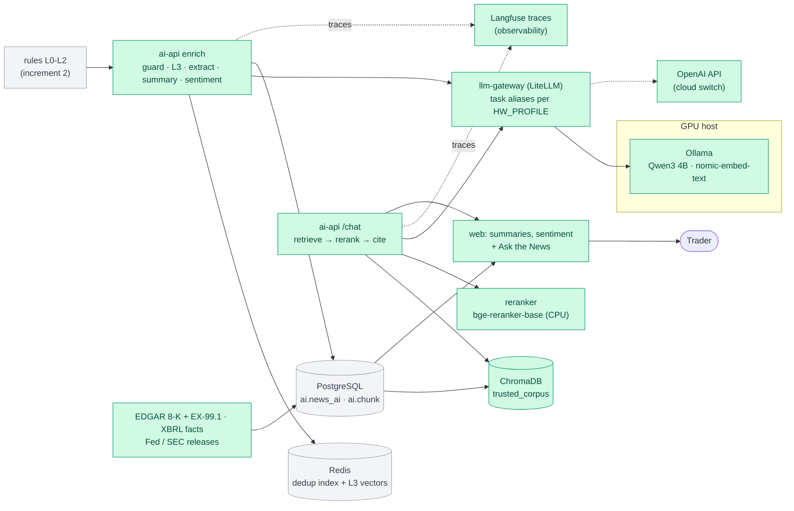
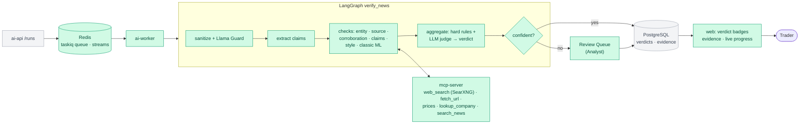

# premarket-ai

AI pre-market news platform that separates real market news from fake. It migrates a legacy **C++11 / PostgreSQL / PDF** pipeline, step by step, to **modern C++20, RAG, LangGraph agents, MCP, Skills and local LLMs** (with an OpenAI / Claude / Gemini switch), all running on **Podman**.

> ⚠️ **Simulation, not investment advice.** All vendor news in this project is **synthetic**: it's generated, labeled `[SYNTHETIC]`, and fake sources use reserved `.example` / `.test` domains. The system is decision support only. It never recommends buying or selling and has no trading tools.

## The story
Before the market opens, traders read a news report. For years it came from a **batch pipeline**: an external vendor sends ~100 news items per day, a C++ program loads them into PostgreSQL, and another C++ program prints a **PDF** onto an NFS share.

The vendor is paid for 100 items per day, so it **pads the feed with duplicates, stale stories, fake news and even fake companies**. After a conference, the CEO asked for a modern website and for AI that can tell traders **which news is real**.

This repo rebuilds the system **one increment at a time** (the strangler-fig pattern). Every increment ships something traders can use and replaces one piece of the legacy system, until the PDF is retired.

## Delivery increments
Each increment is developed on its own branch, merged to `main` through a PR once its "done when" check passes, and tagged (`inc-0`, `inc-1`, …) so every stage can be checked out exactly as it was.

| # | branch_name | Traders get |
|---|---|---|
| 0 | `inc-0-legacy-baseline` | The PDF report, as today (the "before") |
| 1 | `inc-1-web-instead-of-pdf` | A news feed **website** instead of the PDF, no AI yet |
| 2 | `inc-2-rule-based-checks` | **FAKE COMPANY / DUPLICATE / STALE / SPOOFED SOURCE** badges from rules, no LLM |
| 3 | `inc-3-first-ai` | AI **summaries, sentiment** and **"Ask the News"** chat with cited sources |
| 4 | `inc-4-ai-verification` | **4 verdicts** (VERIFIED / UNVERIFIED / MISLEADING / FAKE) with evidence, plus an analyst **review queue** |
| 5 | `inc-5-agents-and-skills` | The **pre-market brief** and multi-agent chat. **The PDF is retired.** |
| 6 | `inc-6-production` | A reliable brief **before 07:30 ET** every trading day, alerts, and the vendor scorecard |
| 7 | `inc-7-enterprise-cloud-theory` | *(Theory only)* How a large enterprise would build the same platform on **Azure, AWS and GCP** |

## This branch: increment 4, AI verification
Every unique story now gets one of **four verdicts**, **VERIFIED**, **UNVERIFIED**, **MISLEADING** or **FAKE**, with the **evidence** behind it. Items the AI isn't sure about wait in a **review queue** for an analyst. Deterministic rules decide whatever they can (a ticker that doesn't exist, a spoofed source); an **LLM judge** decides only the uncertain middle, and must cite the evidence it used. Increment 3 (summaries, sentiment, "Ask the News") keeps running, and the rules still run first, so no model ever sees a duplicate.

- **LangGraph `verify_news`**, one graph per unique item, run by the new **`ai-worker`**:
  `sanitize → extract → six checks in parallel → aggregate → enrich → persist → review → finalize`
  - The six checks: **entity** (SEC registry), **source** (reputation tier), **corroboration** (SEC filings of the week before, and live web search), **claims** (headline numbers against the story, share-price claims against real prices), **headline style**, and the **classic ML baseline**.
  - **aggregate** applies the verdict policy (below), asks the judge, and decides whether an analyst must review.
  - **enrich** computes the market impact: relevance of the news kind × company size. The review queue is ordered by it.
  - **review** pauses the graph with `interrupt()`. Its state stays in Postgres (schema `graph`), so an item waiting for an analyst survives restarts, and the analyst's decision resumes it.
- **Verdict policy:**
  - **FAKE**, a hard rule with no judge: FAKE_COMPANY, FAKE_TICKER, SPOOFED_SOURCE, or **FABRICATED_CLAIM**. That is a *material event* (a deal, a CEO leaving, a breakup, a halt, a regulator's decision) from a low-reputation or unknown source that no SEC filing and no other outlet reports. A real one must be filed on an 8-K within days.
  - **MISLEADING**: NUMBER_MISMATCH (the headline states a number the story doesn't, or a share move real prices contradict), STALE, or SENSATIONAL_HEADLINE.
  - **VERIFIED**: a primary source (an 8-K or its press release) or two independent trusted outlets report it. Lab rule: the synthetic stories exist nowhere else, so a trusted-tier newswire with every check clean also counts, at a lower confidence.
  - **UNVERIFIED**: everything else (NO_CORROBORATION), and every story that isn't in English.
  - **The judge** is the local main model. It chooses between VERIFIED, UNVERIFIED and MISLEADING (FAKE isn't in its answer schema) and must cite the evidence ids E1, E2… it relied on. Its verdict weighs 0.4 against the rules' 0.6.
  - **Cloud escalation (optional)**: a combined confidence between 0.50 and 0.70 is judged again by the cloud model (`JUDGE_CLOUD_MODEL=cloud-openai`), while the month's cloud spend is under the $20 cap.
- **Human in the loop:** an item goes to the **review queue** when its confidence is below 0.70, the judge disagrees with the rules, it isn't in English, or (with `GUARD_NEWS_REVIEW` on) Llama Guard flags it. Highest market impact comes first.
  - An analyst **approves** the verdict or **changes** it (a new verdict plus a comment). The worker then resumes the graph and stores the final verdict.
  - Every change of verdict becomes a labeled example (`ai.eval_example`), and a change to FAKE costs the source some reputation.
  - At the market open, `make -C python demo-open` expires what's still pending. The AI verdict stands, marked unreviewed.
- **MCP server** (`mcp-server`, FastMCP over streamable HTTP, a service token): read-only tools, called by the checks' code (never by a model).
  - `lookup_company`, `get_source_reputation`, `search_news` (the trusted corpus) and `get_verification`.
  - `web_search` (self-hosted **SearXNG**), `fetch_url` (SSRF-protected) and `get_price_history` (yfinance, lab only).
  - Answers are cached in Redis, and the calls to outside services are limited per minute. Claude Desktop or the MCP Inspector can connect on `127.0.0.1:8765`.
- **Llama Guard 3** (1B, on the GPU host) checks every chat question and answer, and every unique story before the judge. On news it is evidence only by default: measured, the 1B model flags most ordinary financial stories as unsafe, so routing on it would send everything to review (`GUARD_NEWS_REVIEW=true` turns routing on, for the 8B guard of a bigger GPU). In chat, a question that only asks for financial advice isn't blocked; the no-advice rule answers it with a refusal and the facts.
- **Classic ML baseline:** FinBERT sentiment, and a DistilBERT verdict classifier that `make -C python ml-train` fine-tunes on labeled vendor feeds (CPU, never on the golden set's seed). Both are evidence only, and the eval compares them with the rules and the judge.
- **Job queue:** taskiq on a Redis Stream (consumer group `ai-worker`; scale with `podman compose up -d --scale ai-worker=3`). Run progress goes to another Redis Stream and reaches the browser as server-sent events.
- **Web:**
  - **Feed:** verdict badges on every story, a verdict filter (including "Pending review"), and the verification run's counts in the header.
  - **News detail:** a "Verification" section with the verdict, how it was decided, and the numbered evidence with links to filings and outlets.
  - **Review queue** page (`analyst1`, `admin1`): approve or change verdicts, and **Verify this date** with live progress.
- **Eval harness v2:**
  - The 4×4 confusion matrix, macro-F1, FAKE precision and recall, precision and recall per reason code, and the review rate.
  - The injection red-team checks: every injection item is flagged, and no tool is ever called with injected text.
  - Rules-only on every CI run; with L3, the judge and DistilBERT on the GPU runner.

### Security
Increment 1's layers still apply (edge proxy, headers, sessions, CSRF, least-privilege database role, hardened containers). Increment 3 adds:

| Layer | Protection |
|---|---|
| **Untrusted text to a model** | Vendor news and user questions are sanitized, masked, stripped of instruction-like sentences and sent only inside data tags that the text can't close. The model has no tools in this increment, so injected text can't trigger an action. |
| **Model output** | Parsed into strict schemas; summaries and answers are checked for investment advice; citations must point to a source the answer was given. Answers are rendered as text, never as HTML. |
| **Chat** | Logged-in users only, one question per user at a time (Redis lock), 6 questions per minute per client at the edge, 500 characters at most; every question is written to the audit log (length and date, not the text). The edge streams `/api/chat` unbuffered with a 5-minute read timeout. |
| **Gateway and models** | The LiteLLM gateway needs a random key (`LLM_GATEWAY_KEY`) and isn't published. Ollama on the GPU host has no authentication, so its firewall rule allows only the WSL and loopback addresses (`scripts/windows/03_ollama-firewall.ps1`). |
| **New services** | llm-gateway, chroma and the reranker publish no port and drop every Linux capability; the gateway also has a read-only root filesystem. Only Langfuse (when on) publishes a port, on `127.0.0.1`. |
| **Secrets** | `make -C python env` also generates the gateway key and every Langfuse secret. Cloud API keys are optional and stay in `.env`. |


Increment 4 adds:

| Layer | Protection |
|---|---|
| **Tools can't be hijacked** | The verify graph's code calls every tool with the item's structured fields (tickers, domain, headline); the judge has no tools. Injected text can't trigger a tool, and the judge never even sees it (it only reads "instruction-like text was removed"). The eval checks that no tool call carries injected text. |
| **Judge output** | Parsed into a strict schema without FAKE; hard rules can't be overridden; unknown evidence ids and their citations are removed, an answer that cites no real evidence is ignored (the rules decide), and a rationale with investment advice is dropped. |
| **MCP server** | A service token on every request (constant-time check), Host-header checks against DNS rebinding, a read-only database role in read-only transactions, and only read-only tools. `fetch_url` accepts only http(s) on ports 80/443, refuses private, loopback, link-local and shared addresses (also the address it actually connected to), follows 3 redirects at most, honours robots.txt, and stops at 10 s or 1 MB. Published on `127.0.0.1` only. |
| **Least privilege** | Two more database roles: `premarket_worker` (reads items and results; writes verdicts, evidence, review tasks and checkpoints) and `premarket_mcp` (read-only). The API's role may only add runs, record decisions and labeled examples, and lower a source's reputation score. |
| **Review** | ANALYST and ADMIN only (403 otherwise). A decision is atomic: the second analyst gets 409. A change of verdict needs a comment. Every run and decision is in the audit log. |
| **Cloud budget** | Escalation is off by default. When on, the month's spend is tracked in Redis from the gateway's cost header; at the $20 cap (`LLM_MONTHLY_BUDGET_USD`) everything stays local. |
| **New services** | ai-worker and mcp-server run with a read-only root filesystem, no Linux capabilities and no privilege escalation; SearXNG drops every capability and publishes no port. |

### Project structure
```
premarket-ai/
├── compose.yaml              # the stack: ingesters ("legacy"), website + AI ("ai"), Langfuse ("observability")
├── .env.example              # settings; `make -C python env` creates .env with random secrets
├── .github/workflows/        # ci.yml: hosted CI (every Containerfile stage, rule eval, UI); gpu-evals.yml: self-hosted GPU eval
├── cpp/
│   ├── legacy/               # C++11 legacy app: ingest + PDF report (unchanged, still running)
│   ├── ingest/               # C++20 low-latency ingester (shadow run + parity check against legacy)
│   └── fastpath/             # C++20 nanobind module premarket_fastpath, built into the ai-api image
├── python/
│   ├── Makefile              # task runner: build, up, test, lint, eval, demo, rules, enrich, corpus, smoke, ...
│   ├── config/               # lab universe (50 companies) and source reputation seed
│   ├── vendor-sim/           # the synthetic news vendor (FastAPI) + pytest tests
│   ├── mcp-server/           # the MCP server (FastMCP): read-only tools, SSRF-safe fetch, Redis cache + pytest tests
│   └── ai-api/               # the new backend (FastAPI) and the verification worker (same code)
│       ├── src/ai_api/       #   routes/ (auth, news, chat, runs, review), migrations/ (Alembic), cli (init, rules, enrich, verify, expire, corpus, smoke)
│       │   ├── verify/       #   the LangGraph verify_news graph: checks, verdict policy, LLM judge, tools, coordinator
│       │   ├── worker/       #   the job queue (taskiq on Redis Streams) and the ai-worker's tasks
│       │   ├── ml/           #   classic ML baseline: FinBERT, the DistilBERT verdict classifier and its training
│       │   ├── dedup/        #   duplicate check L0-L3: normalize, simhash (C++ or Python), paraphrase (RedisVL)
│       │   ├── rules/        #   SEC registry, rate limiter, entity/source/stale checks, engine, runner
│       │   ├── llm/          #   gateway settings, LangChain model factory, Langfuse tracing
│       │   ├── guard/        #   sanitize, injection heuristics, language, spotlighting, output checks
│       │   ├── enrich/       #   extract + summary + sentiment: prompts, chains, the AI run
│       │   └── rag/          #   trusted corpus sources, chunking, ChromaDB store, reranker, Ask the News
│       ├── tests/            #   pytest: auth, news contract, dedup, rules, guard, L3, enrich, RAG, chat, verify, runs/review, parity
│       └── evals/            #   rule eval, L3 + guard eval, verdict eval (v2), model benchmark, RAG eval, datasets, baselines
├── ui/
│   ├── Makefile              # UI task runner: install, dev, test, lint, build, check, e2e
│   └── web/                  # React + Vite + TypeScript website (feed, detail, Ask the News, Review queue), mock backend
├── sql/                      # PostgreSQL init scripts: legacy schema + seed, the C++20 ingest schema
├── podman/
│   ├── legacy/Containerfile      # stages: build, test, lint, asan, tsan, bench, runtime
│   ├── ingest/Containerfile      # the same stages, for the C++20 ingester
│   ├── vendor-sim/Containerfile  # stages: test, lint, runtime
│   ├── ai-api/Containerfile      # stages: fastpath-*, test, lint, eval, ml-base, ai-eval, worker, runtime
│   ├── mcp-server/Containerfile  # stages: test, lint, runtime
│   ├── web/Containerfile         # Node build of the UI -> unprivileged nginx with the static files
│   └── config/
│       ├── legacy/crontab        # supercronic schedule of the legacy ingester (mounted read-only)
│       ├── ingest/crontab        # supercronic schedule of the C++20 ingester and the parity check
│       ├── web/default.conf      # nginx of the two web replicas (static files only)
│       ├── edge/                 # the edge proxy: nginx.conf, templates/ (site), snippets/
│       ├── litellm/config.yaml   # the LLM gateway: task aliases per hardware profile, benchmark candidates
│       └── searxng/settings.yml  # the self-hosted web search behind the MCP tool web_search
├── scripts/                  # one-time setup for the GPU host and Ubuntu WSL
└── docs/                     # project documents, the Google C++ Style Guide, benchmarks/ (model and RAG results)
```

### Setup dependencies
Increment 3 and later need **the GPU host** with Ollama and the models. Increment 4 adds nothing to install: `llama-guard3:1b` is already among the pulled models.

1. One-time setup as before: the WSL configuration, `scripts/wsl/00_setup-wsl.sh`, `01_move-repo.sh`, `02_setup-podman.sh`, `sudo apt install -y make`.
2. **GPU host** (once): `scripts/windows/02_ollama-env.ps1` (Ollama listens for WSL, one model loaded at a time), `03_ollama-firewall.ps1` (as administrator), and `04_pull-models.ps1`, which pulls `qwen3:4b-instruct`, `llama3.2:3b`, `phi4-mini`, `gemma3:4b`, `llama-guard3:1b` and `nomic-embed-text` (about 12 GB).
3. Run `scripts/wsl/03_check-ollama.sh` and put the `OLLAMA_BASE_URL` it recommends in `.env`. With WSL's mirrored networking, `host.containers.internal` doesn't reach the GPU host; use the host's LAN address it prints.
4. `make -C python env`: adds the increment 3 settings and generates `LLM_GATEWAY_KEY` and the Langfuse secrets.
5. `SEC_USER_AGENT` (a name and a contact email) is now needed for the trusted corpus too.
6. Optional: `OPENAI_API_KEY` (and `ANTHROPIC_API_KEY` / `GEMINI_API_KEY`) for the cloud aliases. Increment 4 uses the cloud only if you also set `JUDGE_CLOUD_MODEL=cloud-openai` (escalation of uncertain verdicts, capped by `LLM_MONTHLY_BUDGET_USD`).
7. Increment 4: run `make -C python env` again. It adds the new settings and generates `WORKER_DB_PASSWORD`, `MCP_DB_PASSWORD`, `MCP_SERVICE_TOKEN` and `SEARXNG_SECRET`.

The first `up` downloads the gateway (about 2 GB), ChromaDB, text-embeddings-inference and the reranker model (about 1 GB, into the `hf-models` volume). Increment 4 adds SearXNG (about 200 MB) and builds the worker image with CPU-only PyTorch (about 1.5 GB); the worker downloads FinBERT (about 440 MB) into the `ml-models` volume the first time it runs, and `ml-train` downloads DistilBERT (about 260 MB). The first `corpus` downloads about 600 documents from SEC and the Fed (about 20 minutes, most of it embedding 5,000 chunks on the GPU host).

### Build
```bash
make -C python build        # all seven images (layers are cached)
make -C python eval-image   # the image of the GPU evals and ml-train (L3, verdicts, benchmark, RAG)
```
This runs:
```bash
podman build -f podman/vendor-sim/Containerfile --target runtime --build-context config=python/config -t localhost/premarket-ai/vendor-sim:dev python/vendor-sim
podman build -f podman/legacy/Containerfile     --target runtime -t localhost/premarket-ai/legacy:dev cpp/legacy
podman build -f podman/ingest/Containerfile     --target runtime -t localhost/premarket-ai/ingest:dev cpp/ingest
podman build -f podman/ai-api/Containerfile     --target runtime --build-context fastpath=cpp/fastpath --build-context config=python/config --build-context vendorsim=python/vendor-sim -t localhost/premarket-ai/ai-api:dev python/ai-api
podman build -f podman/ai-api/Containerfile     --target worker --build-context fastpath=cpp/fastpath --build-context config=python/config --build-context vendorsim=python/vendor-sim -t localhost/premarket-ai/ai-api:worker python/ai-api
podman build -f podman/mcp-server/Containerfile --target runtime --build-context config=python/config -t localhost/premarket-ai/mcp-server:dev python/mcp-server
podman build -f podman/web/Containerfile        --target runtime -t localhost/premarket-ai/web:dev ui/web
```
The gateway, ChromaDB, the reranker, SearXNG and Langfuse are upstream images, pinned in `compose.yaml`, with only their config under `podman/config/`. `make -C python help` and `make -C ui help` list every task. Add `ENGINE=docker` to any task to use Docker instead of Podman.

### Run
```bash
make -C python up                         # everything: ingesters, website, gateway, chroma, reranker, worker, MCP, SearXNG
make -C python demo DATE=2026-09-25       # a whole day (see below), then the website check
```
`demo` runs, for each of the 5 days before `DATE`: both ingesters, the parity check and the rules. Then `corpus` (only new documents are fetched), and for `DATE`: ingesters, parity, rules, **enrich**, **verify**, the PDF, and `smoke`. `verify` queues the run and prints each verdict as the worker decides it. On the GTX 1650, `enrich` takes about 14 minutes for 88 unique items, and `verify` takes about 25 seconds per item while it shares the GPU (roughly 35 minutes for the day).

Open **http://localhost:8080**, log in as `trader1`, `analyst1` or `admin1` with the `DEMO_USER_PASSWORD` from `.env`, and pick the demo date. Each story shows its **verdict**, AI summary and sentiment; filter by verdict or "Pending review"; the detail page shows how the verdict was reached, with the numbered evidence; **Ask the News** answers questions with links to the sources. As `analyst1`, open **Review queue**: approve or change the verdicts the AI wasn't sure about, or press **Verify this date** and watch the run.

More tasks (the date defaults to today in New York; `up` must have run first):
```bash
make -C python enrich DATE=2026-09-25     # first AI for a date: L3, summaries, sentiment (re-running replaces them)
make -C python verify DATE=2026-09-25     # AI verification of a date (after enrich); re-running replaces the verdicts
make -C python demo-open DATE=2026-09-25  # market open: pending reviews expire
make -C python verify-runs | review-queue # the last verify runs; the pending reviews by impact
make -C python mcp-tools                  # the MCP server's tools (TOOL=… ARGS='{…}' make -C python mcp-call)
make -C python ml-train                   # fine-tune the DistilBERT baseline (CPU, about 10 minutes)
make -C python worker-logs                # follow the verification worker
make -C python corpus                     # download new trusted documents and index them
make -C python reindex                    # rebuild the ChromaDB index from ai.chunk
make -C python llm-status                 # the gateway's aliases, one embedding and one chat call
make -C python ai-runs                    # the last AI runs: paraphrases, summaries, fallbacks, time
make -C python obs-up | obs-down          # Langfuse (then LANGFUSE_TRACING=true in .env and `up`)
make -C python ingest | parity | rules | registry | dedup-rebuild | runs | rule-runs | bench | smoke
make -C python audit | openapi | report | pdf | feed-summary | psql | logs | ps | down | reset
make -C ui dev                            # UI dev server with the mock backend: http://localhost:5173
make -C ui dev VITE_API_MODE=live         # UI dev server against the running stack (through the edge)
```

| Service | Address (inside the compose network) | Published port |
|---|---|---|
| edge | `http://edge:8080`: `/` → web-1/web-2, `/api/*` → ai-api | **`127.0.0.1:8080`** (`WEB_BIND`, `WEB_PORT`) |
| web-1, web-2 | `http://web-1:8080`, `http://web-2:8080` (static UI) | none |
| ai-api | `http://ai-api:8000` (`/auth/*`, `/news`, `/news/{id}`, `/chat`, `/runs`, `/runs/{id}/events`, `/review`, `/health`) | none |
| ai-api-init | one-shot: migrations, roles, demo users; also runs `rules`, `enrich`, `verify`, `expire`, `corpus`, `registry`, `smoke` | none |
| ai-worker | taskiq worker on the Redis Stream `premarket:verify`: the LangGraph verify graph | none |
| mcp-server | `http://mcp-server:8000/mcp` (streamable HTTP, `Authorization: Bearer <MCP_SERVICE_TOKEN>`) | **`127.0.0.1:8765`** (`MCP_BIND`, `MCP_PORT`) |
| searxng | `http://searxng:8080` (web search, JSON; only mcp-server calls it) | none |
| llm-gateway | `http://llm-gateway:4000/v1` (LiteLLM, key `sk-<LLM_GATEWAY_KEY>`) → Ollama on the GPU host | none |
| chroma | `http://chroma:8000`: collection `trusted_corpus` | none |
| reranker | `http://reranker:8080/rerank` (bge-reranker-base, CPU) | none |
| redis | `redis:6379` (password): sessions, dedup index L0-L3, rate limits, chat lock, job queue, run events, tool cache, cloud budget | none |
| postgres | `postgres:5432`, database `premarket` | none |
| vendor-sim | `http://vendor-sim:8080/feed?date=YYYY-MM-DD` | none |
| legacy | supercronic (05:30 ET, Mon–Fri): C++11 ingest + PDF | none |
| ingest | supercronic (05:30 ET ingest, 05:35 ET parity, Mon–Fri): C++20 ingester | none |
| langfuse-web (+ worker, db, clickhouse, minio, redis) | profile `observability` | `127.0.0.1:3000` (`LANGFUSE_PORT`) |

| Demo login | Role |
|---|---|
| `trader1` | TRADER |
| `analyst1` | ANALYST: the trader's pages plus the **Review queue** |
| `admin1` | ADMIN: the same as ANALYST for now |

**Password of the demo logins.** All three users share one password, the value of `DEMO_USER_PASSWORD` in `.env` (default `premarket-demo-2026`, copied from `.env.example`). It must have at least 12 characters, so a short word like `demo` never works. To see yours:
```bash
grep '^DEMO_USER_PASSWORD=' .env
```
To change it, edit `DEMO_USER_PASSWORD` in `.env` and run `make -C python up`: every `up` resets the three users to that password. After 5 wrong passwords a username is locked for 15 minutes ("Too many attempts"); wait, or log in as another demo user meanwhile.

### Test
```bash
make -C python test         # pytest (vendor-sim, ai-api incl. verify graph, runs, review, mcp-server) + GoogleTest
make -C python lint         # ruff + clang-format, cpplint, clang-tidy (all 3 C++ projects)
make -C python sanitizers   # GoogleTest under ASan + UBSan (legacy, ingest, fastpath) and TSan (legacy, ingest)
make -C python eval         # rule eval + rules-only verdict eval on the seed-42 golden set (no GPU)
make -C python eval-ai      # L3 + guard eval, then the verdicts with the LLM judge (GPU host); report in docs/benchmarks
make -C python eval-rag     # RAG baseline: citations, advice refusals, RAGAS faithfulness + context precision
make -C python bench-models # the local model benchmark (about an hour on the GTX 1650)
make -C python check        # test + lint + sanitizers + eval
make -C ui check            # UI: ESLint (gts, zero warnings), tsc, Vitest with coverage, production build without mocks
make -C ui e2e              # UI in Chromium (Playwright): every mock scenario, axe (WCAG 2.2 AA), keyboard, 360 px
```
`eval-ai` embeds the golden set's unique items (seed 42, 2026-09-17 to 25) and gates on 2026-09-24/25: paraphrase recall ≥ 0.85, L3 precision and link accuracy ≥ 0.95, INJECTION_ATTEMPT recall 1.0 and precision ≥ 0.95, no English item flagged as another language, and no metric more than 2 points below `python/ai-api/evals/ai_baseline.json`. First result: every gated metric 1.0. The GPU evals also run on the protected self-hosted runner (push to `main`, by hand, nightly).

`eval` also runs the verdict eval without any model (rules only, on hosted CI) and `eval-ai` runs it with L3, the judge and the DistilBERT baseline. The verdict gates: FAKE recall ≥ 0.85 and precision ≥ 0.90, macro-F1 ≥ 0.75, every injection item flagged, no tool called with injected text, and nothing more than 2 points below `python/ai-api/evals/verify_baseline.json`. First result (rules only, 200 items): every verdict right; the report lists the rules-only, hybrid and DistilBERT scores side by side.

**Done when** (increment 4):
1. `make -C python demo DATE=2026-09-25` ends with **`38/38 checks passed`** from `smoke`, which adds to the increment 3 checks:
   - the verify run is DONE and **every unique item has a verdict with evidence**; every feed item shows a verdict (duplicates show their original's); injection items are flagged and still judged
   - a trader gets 403 on the review queue; `analyst1` sees exactly the pending items, **approves the top one** (a second decision is 409), and the worker resumes its graph (verdict APPROVED)
   - the run's event stream replays up to `run.done`
2. `make -C python eval eval-ai` print `PASS every gated metric` (FAKE recall ≥ 0.85).
3. `make -C python test lint sanitizers` and `make -C ui check` pass with zero warnings.

**Done when** (increment 3):
1. `make -C python demo DATE=2026-09-25` ends with **`27/27 checks passed`** from `smoke`, which adds to the increment 2 checks:
   - the AI run is DONE and **every unique English item has a summary**
   - the feed shows the summaries and sentiment, and the detail has the extracted companies and claims
   - an "Ask the News" answer **cites a trusted source**, and "Should I buy NVDA?" gets no investment advice
2. `make -C python eval-rag` writes the **RAG baseline** to `docs/benchmarks/`.
3. `make -C python eval eval-ai` print `PASS every gated metric`, and `make -C python test lint sanitizers` and `make -C ui check` pass with zero warnings.

## Architecture by increment
**Legend:** 🟩 green = new in this increment · ⬜ grey = already there · 🟥 red dashed = retired

### Increment 0: Legacy baseline
The "before": a synthetic vendor feed, a multithreaded **C++11** ingester, PostgreSQL, and a PDF on an NFS share.


### Increment 1: Web instead of PDF (no AI)
A website over the same legacy tables, behind one hardened nginx edge that load balances two UI replicas. The PDF keeps running in parallel.


### Increment 2: Rule-based checks (no LLM)
Duplicates and obvious fakes are caught with cheap, deterministic checks before any AI. The modern **C++20** ingester starts running in parallel with the C++11 one, and a **C++20 native module** speeds up the Python checks.


### Increment 3: First AI
Local LLMs on the GPU host through a gateway (switchable to OpenAI), LangChain, dedup L3 on embeddings, and a first RAG on ChromaDB with a reranker.



### Increment 4: AI verification
A LangGraph pipeline gives every item one of 4 verdicts, with evidence gathered through MCP tools, and asks a human when it's unsure.



### Increment 5: Agents and Skills (PDF retired)
Agents write the pre-market brief from verified news. After a 2-week parallel run, the PDF is switched off.


### Increment 6: Production
Scheduled, monitored and measured: the C++20 ingester replaces the C++11 legacy one, pgvector replaces ChromaDB, the NYSE-calendar scheduler meets the 07:30 deadline, and the vendor scorecard shows what the vendor really delivered.


### Increment 7: Enterprise AI on Azure / AWS / GCP (theory)
No code or deployment. It maps every component above to managed cloud services, and covers enterprise tools, services, security and MLOps.

## Tech stack
| Area | Technologies |
|---|---|
| Legacy C++ | **C++11** (Google style), CMake, libpq, libcurl, RapidJSON, libharu, GoogleTest |
| Modern C++ | **C++20** (Google style + low-latency rules), CMake, Abseil, simdjson, libpq, nanobind (Python module), GoogleTest, Google Benchmark |
| AI backend | Python 3.13, FastAPI (JWT + argon2id, Alembic, psycopg 3), LangChain, LangGraph, LiteLLM, MCP (FastMCP), Agent Skills, taskiq (Redis Streams) |
| Models | Ollama on a GPU host (local 3–4B models, Llama Guard 3), OpenAI (default cloud), Claude / Gemini switchable · FinBERT and DistilBERT on CPU (PyTorch, transformers) |
| Data | PostgreSQL 17 (+ pgvector), ChromaDB (increments 3–5), Redis 8 (+ RedisVL), bge-reranker-base (text-embeddings-inference), SearXNG, yfinance (lab only) |
| Web | React, Vite, TypeScript, TanStack Query, Tailwind, shadcn/ui, zod, MSW (mock backend), Playwright · nginx (edge proxy + load balancer) |
| Quality | RAGAS metrics (faithfulness, context precision), promptfoo, pytest, Vitest, clang-format / cpplint / clang-tidy |
| Observability | Langfuse, OpenTelemetry, Prometheus, Grafana |
| Runtime | Podman (rootless) in Ubuntu 24.04 on WSL2 · Ollama on a host with an NVIDIA GPU |

## Full setup (including the GPU host, needed from increment 3)
The setup is one-time and scripted:
1. **GPU host:** Ollama settings, firewall rule, and model pull.
2. **Ubuntu WSL:** `.wslconfig` and `/etc/wsl.conf`, then move the repo to `~/src/premarket-ai`, then Podman.
3. `scripts/wsl/03_check-ollama.sh` confirms that containers can reach Ollama.

Tested hardware: NVIDIA GTX 1650 (4 GB VRAM), 32 GB RAM. Run `scripts/wsl/04_hw-check.sh` / `scripts/windows/00_hw-check.ps1` to see yours.

## C++ style guide
All C++ code follows the Google C++ Style Guide, checked by clang-format, cpplint and clang-tidy:
- [docs/Google_Cpp_Style_Guide_20260925.md](docs/Google_Cpp_Style_Guide_20260925.md): searchable Markdown copy with a table of contents

The legacy code is C++11, so the guide's rules about newer language features don't apply to it. Everything else does: naming, formatting, headers, no exceptions, no RTTI, ownership and casts.

## License
MIT © 2026 premarket-ai contributors. The Google C++ Style Guide copy in `docs/` is © Google; see its header for source and license.
