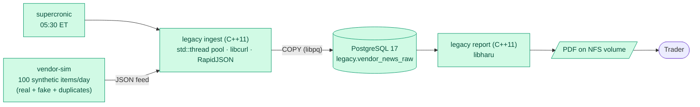
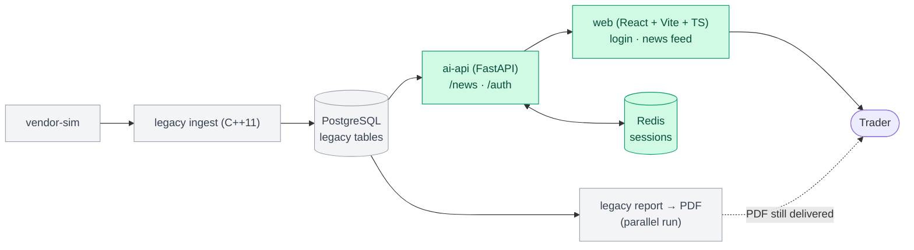
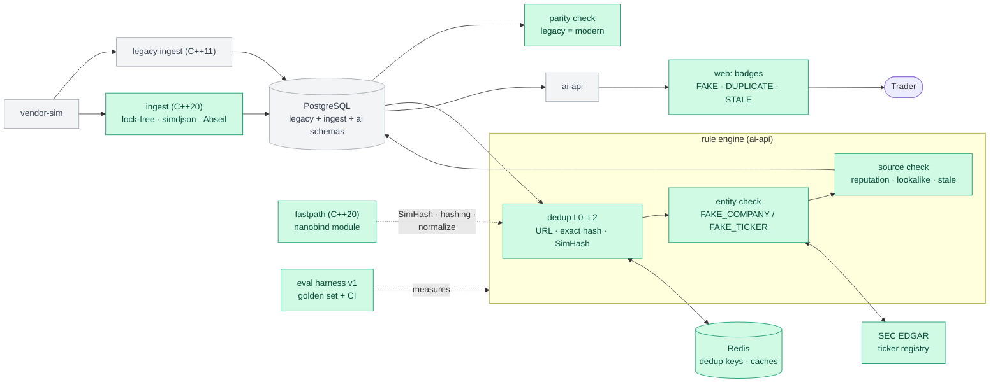
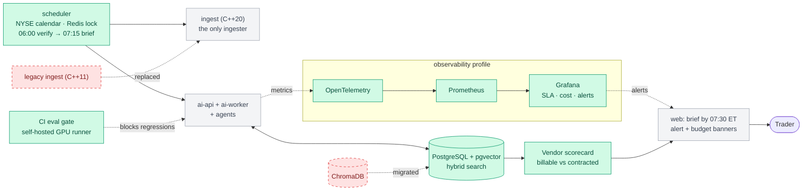

# premarket-ai

AI pre-market news platform that separates real market news from fake. It migrates a legacy **C++11 / PostgreSQL / PDF** pipeline, step by step, to **modern C++20, RAG, LangGraph agents, MCP, Skills and local LLMs** (with an OpenAI / Claude / Gemini switch), all running on **Podman**.

> ⚠️ **Simulation, not investment advice.** All vendor news in this project is **synthetic**: it's generated, labeled `[SYNTHETIC]`, and fake sources use reserved `.example` / `.test` domains. The system is decision support only. It never recommends buying or selling and has no trading tools.

## The story
Before the market opens, traders read a news report. For years it came from a **batch pipeline**: an external vendor sends ~100 news items per day, a C++ program loads them into PostgreSQL, and another C++ program prints a **PDF** onto an NFS share.

The vendor is paid for 100 items per day, so it **pads the feed with duplicates, stale stories, fake news and even fake companies**. After a conference, the CEO asked for a modern website and for AI that can tell traders **which news is real**.

This repo rebuilds the system **one increment at a time** (the strangler-fig pattern). Every increment ships something traders can use and replaces one piece of the legacy system, until the PDF is retired.

## Delivery increments
Each increment is developed on its own branch, merged to `main` through a PR once its "done when" check passes, and tagged (`inc-0`, `inc-1`, …) so every stage can be checked out exactly as it was.

| # | branch_name | Traders get |
|---|---|---|
| 0 | `inc-0-legacy-baseline` | The PDF report, as today (the "before") |
| 1 | `inc-1-web-instead-of-pdf` | A news feed **website** instead of the PDF, no AI yet |
| 2 | `inc-2-rule-based-checks` | **FAKE COMPANY / DUPLICATE / STALE / SPOOFED SOURCE** badges from rules, no LLM |
| 3 | `inc-3-first-ai` | AI **summaries, sentiment** and **"Ask the News"** chat with cited sources |
| 4 | `inc-4-ai-verification` | **4 verdicts** (VERIFIED / UNVERIFIED / MISLEADING / FAKE) with evidence, plus an analyst **review queue** |
| 5 | `inc-5-agents-and-skills` | The **pre-market brief** and multi-agent chat. **The PDF is retired.** |
| 6 | `inc-6-production` | A reliable brief **before 07:30 ET** every trading day, alerts, and the vendor scorecard |
| 7 | `inc-7-enterprise-cloud-theory` | *(Theory only)* How a large enterprise would build the same platform on **Azure, AWS and GCP** |
## Architecture by increment
**Legend:** 🟩 green = new in this increment · ⬜ grey = already there · 🟥 red dashed = retired

### Increment 0: Legacy baseline
The "before": a synthetic vendor feed, a multithreaded **C++11** ingester, PostgreSQL, and a PDF on an NFS share.

### Increment 1: Web instead of PDF (no AI)
A website over the same legacy tables. The PDF keeps running in parallel.

### Increment 2: Rule-based checks (no LLM)
Duplicates and obvious fakes are caught with cheap, deterministic checks before any AI. The modern **C++20** ingester starts running in parallel with the C++11 one, and a **C++20 native module** speeds up the Python checks.

### Increment 3: First AI
Local LLMs on a GPU host (switchable to OpenAI), LangChain, and a first RAG on ChromaDB.

### Increment 4: AI verification
A LangGraph pipeline gives every item one of 4 verdicts, with evidence gathered through MCP tools, and asks a human when it's unsure.

### Increment 5: Agents and Skills (PDF retired)
Agents write the pre-market brief from verified news. After a 2-week parallel run, the PDF is switched off.

### Increment 6: Production
Scheduled, monitored and measured: the C++20 ingester replaces the C++11 legacy one, pgvector replaces ChromaDB, the NYSE-calendar scheduler meets the 07:30 deadline, and the vendor scorecard shows what the vendor really delivered.

### Increment 7: Enterprise AI on Azure / AWS / GCP (theory)
No code or deployment. It maps every component above to managed cloud services, and covers enterprise tools, services, security and MLOps.

## Tech stack
| Area | Technologies |
|---|---|
| Legacy C++ | **C++11** (Google style), CMake, libpq, libcurl, RapidJSON, libharu, GoogleTest |
| Modern C++ | **C++20** (Google style + low-latency rules), CMake, Abseil, simdjson, libpq, nanobind (Python module), GoogleTest, Google Benchmark |
| AI backend | Python 3.13, FastAPI, LangChain, LangGraph, LiteLLM, MCP (FastMCP), Agent Skills, arq |
| Models | Ollama on a GPU host (local 3–4B models, Llama Guard 3), OpenAI (default cloud), Claude / Gemini switchable |
| Data | PostgreSQL 17 (+ pgvector), ChromaDB (increments 3–5), Redis 8 |
| Web | React, Vite, TypeScript, TanStack Query, Tailwind, shadcn/ui |
| Quality | RAGAS, promptfoo, pytest, Vitest, clang-format / cpplint / clang-tidy |
| Observability | Langfuse, OpenTelemetry, Prometheus, Grafana |
| Runtime | Podman (rootless) in Ubuntu 24.04 on WSL2 · Ollama on a host with an NVIDIA GPU |

## Getting started
The setup is one-time and scripted:
1. **GPU host:** Ollama settings, firewall rule, and model pull.
2. **Ubuntu Linux or WSL:** `.wslconfig` and `/etc/wsl.conf`, then move the repo to `~/src/premarket-ai`, then Podman.
3. `scripts/wsl/check-ollama.sh` confirms that containers can reach Ollama.

Tested hardware: NVIDIA GTX 1650 (4 GB VRAM), 32 GB RAM. Run `scripts/hw-check.sh` / `scripts/hw-check.ps1` to see yours.

## C++ style guide
All C++ code follows the Google C++ Style Guide:
- [docs/Google_Cpp_Style_Guide_20260925.md](docs/Google_Cpp_Style_Guide_20260925.md): searchable Markdown copy with a table of contents
- [docs/Google_Cpp_Style_Guide_20260925.pdf](docs/Google_Cpp_Style_Guide_20260925.pdf): original print (2026-09-25)

## License
MIT © 2026 premarket-ai contributors. The Google C++ Style Guide copy in `docs/` is © Google; see its header for source and license.
