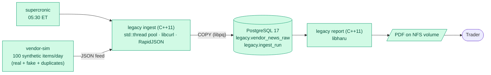
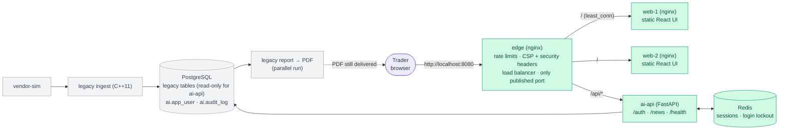
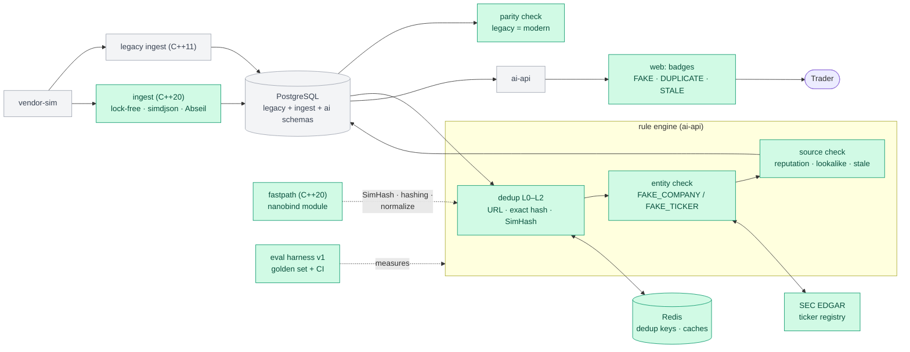
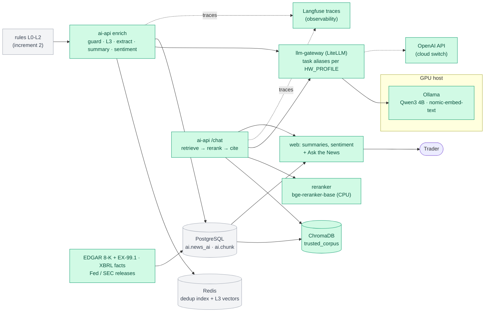
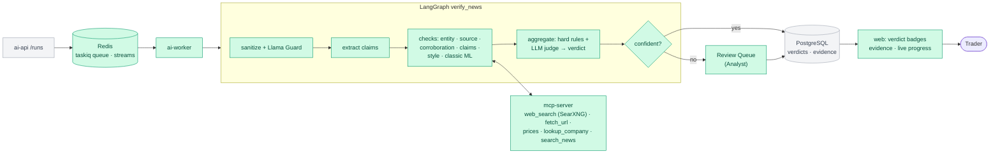
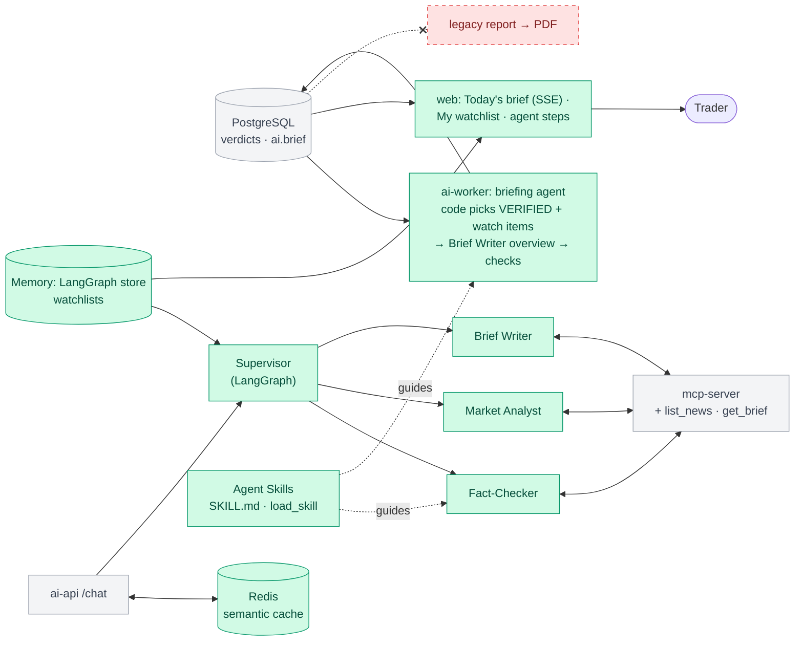
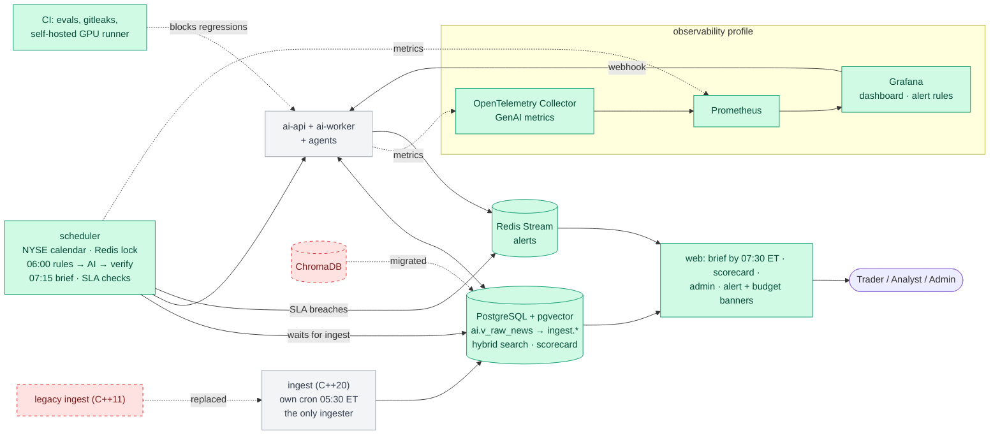
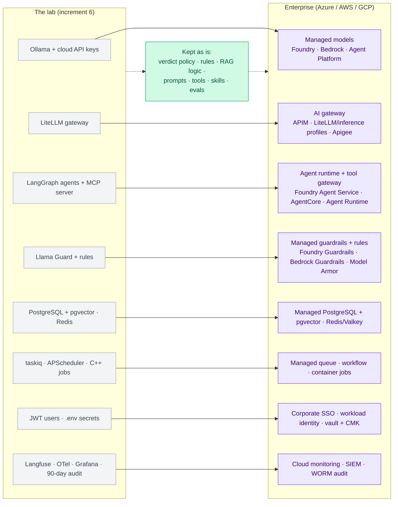
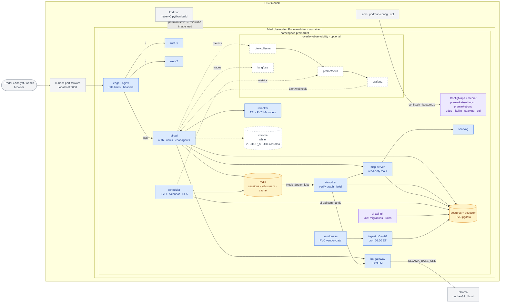

# premarket-ai

AI pre-market news platform that separates real market news from fake. It migrates a legacy **C++11 / PostgreSQL / PDF** pipeline, step by step, to **modern C++20, RAG, LangGraph agents, MCP, Skills and local LLMs** (with an OpenAI / Claude / Gemini switch), all running on **Podman**, and from increment 8 also on **Kubernetes** (Minikube), with the same images.

> ⚠️ **Simulation, not investment advice.** All vendor news in this project is **synthetic**: it's generated, labeled `[SYNTHETIC]`, and fake sources use reserved `.example` / `.test` domains. The system is decision support only. It never recommends buying or selling and has no trading tools.

## The story
Before the market opens, traders read a news report. For years it came from a **batch pipeline**: an external vendor sends ~100 news items per day, a C++ program loads them into PostgreSQL, and another C++ program prints a **PDF** onto an NFS share.

The vendor is paid for 100 items per day, so it **pads the feed with duplicates, stale stories, fake news and even fake companies**. After a conference, the CEO asked for a modern website and for AI that can tell traders **which news is real**.

This repo rebuilds the system **one increment at a time** (the strangler-fig pattern). Every increment ships something traders can use and replaces one piece of the legacy system, until the PDF is retired.

## Delivery increments
Each increment is developed on its own branch, merged to `main` through a PR once its "done when" check passes, and tagged (`inc-0`, `inc-1`, …) so every stage can be checked out exactly as it was.

| # | branch_name | Traders get |
|---|---|---|
| 0 | `inc-0-legacy-baseline` | The PDF report, as today (the "before") |
| 1 | `inc-1-web-instead-of-pdf` | A news feed **website** instead of the PDF, no AI yet |
| 2 | `inc-2-rule-based-checks` | **FAKE COMPANY / DUPLICATE / STALE / SPOOFED SOURCE** badges from rules, no LLM |
| 3 | `inc-3-first-ai` | AI **summaries, sentiment** and **"Ask the News"** chat with cited sources |
| 4 | `inc-4-ai-verification` | **4 verdicts** (VERIFIED / UNVERIFIED / MISLEADING / FAKE) with evidence, plus an analyst **review queue** |
| 5 | `inc-5-agents-and-skills` | The **pre-market brief** and multi-agent chat. **The PDF is retired.** |
| 6 | `inc-6-production` | A reliable brief **before 07:30 ET** every trading day, alerts, and the vendor scorecard |
| 7 | `inc-7-enterprise-cloud-theory` | *(Theory only)* How a large enterprise would build the same platform on **Azure, AWS and GCP** |
| 8 | `inc-8-minikube-kubernetes` | The same site and brief, run on **Kubernetes** (Minikube) instead of Podman compose: same images, configs and `.env` |

## This branch: increment 8, Kubernetes on Minikube
This increment changes **no code, no Containerfile and no `compose.yaml`**. It runs the increment 6 stack on a single-node **Kubernetes** cluster (Minikube in Ubuntu WSL, rootless Podman driver, containerd) as a second, optional runtime next to Podman compose. Traders get exactly the same site, brief and chat.

- **Same images:** `make -C python build` builds them with Podman as before, and `make -C minikube-kubernetes load-images` copies them into the cluster (`podman save` → `minikube image load`, no registry, `imagePullPolicy: Never`).
- **Same configs and `.env`:** kustomize reads `podman/config/*` and `sql/*.sql` in place as ConfigMaps. `.env` becomes the Secret `premarket-env` (passwords, keys, tokens) plus the ConfigMap `premarket-settings` (the tunables, with compose's defaults).
- **Same architecture:** each compose service is a Deployment plus a Service with the same name, and `ai-api-init` is a Job. The edge is still the only entry, reached with `kubectl port-forward`. Ollama still runs on the GPU host, outside the cluster.
- **Same checks:** `make -C minikube-kubernetes demo` runs the demo day and ends with the same `smoke` check through the edge as compose.
- **`minikube-kubernetes/`:** `base/` (profile ai), `chroma/` (while `VECTOR_STORE=chroma`), `observability/` (Langfuse, OTel Collector, Prometheus, Grafana), a `Makefile` with the same task names as `make -C python`, and the scripts that turn `.env` into Kubernetes config and load the images.

How to install, run and test it: **Run on Kubernetes (Minikube)** below. The architecture: **Increment 8** under Architecture by increment.

## Increment 7, enterprise AI on Azure / AWS / GCP (theory)
This increment adds **no code, no containers and no cloud resources**. It explains how a **large regulated firm** (a bank, broker-dealer or asset manager) would build the same platform on a hyperscaler, and compares every choice with what the lab does. The running system is increment 6, unchanged.

The folder `docs/enterprise/` holds eleven date-stamped Markdown pages with Mermaid diagrams:
- **A cloud-neutral reference architecture:** private by default, corporate identity and workload identities instead of keys, one AI gateway in front of every model, read-only agent tools behind a tool gateway, immutable (WORM) audit, everything as code.
- **The same architecture on each cloud:** Azure (Microsoft Foundry, API Management AI gateway, Container Apps), AWS (Amazon Bedrock, Bedrock AgentCore, ECS on Fargate) and GCP (Gemini Enterprise Agent Platform, formerly Vertex AI; Apigee; Cloud Run).
- **A service mapping:** every lab component (models, gateway, embeddings, pgvector, RAG, LangGraph agents, MCP tools, Llama Guard, Redis, queue, scheduler, C++ batch, web, auth, secrets, observability, evals, IaC, budget) and its Azure, AWS and GCP service, plus the product renames of 2025–2026. Names were checked against the providers' documentation on 2026-09-26.
- **Security:** the OWASP Top 10 for LLM Applications and for Agentic Applications, identity, network, data, supply chain, audit and compliance frameworks (NIST AI RMF, ISO/IEC 42001, EU AI Act, US model risk guidance, SEC/FINRA recordkeeping). Each control is marked done, partly done or not done in the lab, with the reason, and the page ends with a production checklist.
- **MLOps / LLMOps:** data, build, offline evals, model risk approval, safe release (shadow, canary), online monitoring, the feedback loop and FinOps, each mapped to the lab in the same way.
- **Build vs buy:** which components a firm would buy as managed services, which it would keep from the lab (the verdict policy, rules, RAG logic, tools, prompts and evals), and how open standards (OpenAI-compatible APIs, MCP, A2A, OpenTelemetry, pgvector, LangGraph) limit lock-in.
- **An AI glossary:** about 100 terms, each with where it shows up in this project.
- **AI engineer vs ML engineer:** the two roles side by side, and which parts of this project each would build.

## Increment 6, production (still running)
The day now runs **by itself on the NYSE calendar** and is **measured**: the brief is published before 07:30 ET on every trading day, analysts see an alert when a deadline is missed, and the vendor scorecard shows what the vendor really delivered. Two more pieces of the old stack are replaced.

- **The C++11 legacy ingester is retired.** The C++20 ingester (zero parity differences over every demo day) is now the only ingest. The strangler-fig views `ai.v_raw_news` / `ai.v_ingest_run` read its tables (`ingest.*`), and every AI result stays attached to its item. The legacy container stays under the opt-in compose profile `legacy` for before/after comparisons; `LEGACY_INGEST=true` runs it again in parallel with the parity check. The final legacy vs modern benchmark (`make -C python bench`): the C++20 ingester halves the per-item p99, processes a feed 4–15× faster, and its queue moves 29× more items per second.
- **pgvector replaces ChromaDB.** The RAG vectors live in `ai.chunk.embedding` (HNSW, cosine) next to the chunk text, and retrieval is **hybrid**: the vector neighbours and Postgres full-text matches in one SQL query, fused by reciprocal rank. `make -C python migrate-vectors` re-embeds the corpus with the same model, compares the top-k chunks of the RAG eval questions against ChromaDB (a report next to the other benchmark results) and switches `VECTOR_STORE=pgvector`; `make -C python eval-rag` then scores the answers on pgvector next to the ChromaDB baseline. ChromaDB stays under the opt-in profile `chroma`.
- **The scheduler** (`python/scheduler`, APScheduler, NYSE calendar via `exchange_calendars`, America/New_York):
  | Time (ET) | Job |
  |---|---|
  | 02:00 | retention: AI results older than 90 days are deleted (the analysts' overrides are kept as labeled examples) |
  | 05:00 | corpus: new 8-Ks and Fed/SEC releases |
  | 05:30 | the C++20 ingester's own cron |
  | 06:00 | wait for the ingest run, then rules → AI → the verify run |
  | 06:15 · 06:30 · 07:00 · 07:30 | SLA checks: ingest DONE · at most 50 verify jobs queued · verification DONE · brief published |
  | 07:15 · 09:00 | the morning brief · the refresh |
  | 09:30 · 09:35 | pending reviews expire · the day's vendor scorecard |

  Weekends and NYSE holidays are skipped. A Redis lock (`run:premarket:{date}`) keeps a job from running twice, a restart catches up on the jobs whose window is still open, and every job and SLA check is recorded (`make -C python sla`). `RUN_MODE=production` runs this timeline; `RUN_MODE=demo` (the default) only runs the nightly cleanup, and `make -C python demo` runs a whole day at once.
- **Alerts, UI banner only:** an SLA breach, a failed job, and the cloud budget crossing 80% or 100% go to the Redis Stream `alerts`; analysts and admins see them live in a banner under the header. Everyone sees "Cloud budget reached, running local" at the cap.
- **Observability profile:** the **OpenTelemetry Collector**, **Prometheus** and **Grafana** join Langfuse. ai-api, ai-worker and the batch commands export OpenTelemetry metrics with the **GenAI semantic conventions** (`gen_ai.client.operation.duration`, `gen_ai.client.token.usage` per model alias), request latency and worker liveness; the scheduler exports the SLA checks, job runs and today's operations (verdict mix, dedup hits, backlog, cloud spend). The Grafana dashboard **premarket-ai operations** shows them, and its alert rules (no worker running, a worker restart loop, verification stalled) call ai-api's webhook, which puts them in the same banner.
- **Vendor scorecard** (`/scorecard`, ANALYST/ADMIN): items received, unique, duplicates by type, stale, FAKE and MISLEADING rates, injection items, corroboration, analyst overrides, cloud cost, and **billable items (unique VERIFIED or UNVERIFIED) against the 100 contracted**, over 30 days with a trend chart, CSV export and a **weekly summary** written with the `vendor-scorecard` skill. Today's schedule and SLA checks are on the same page.
- **Admin page** (`/admin`, ADMIN): users (create, change role, disable, reset password), the source reputation list, and the LLM settings: the pinned models, the month's budget and three **cloud switches** (cloud models at all, judge escalation, the brief's overview). "Ask the News" stays local, because a streamed answer doesn't report its cost.
- **CI:** the scheduler's tests and lint, the collector, Prometheus and dashboard configs, and **gitleaks** over the whole git history join the hosted jobs; **Renovate** (`.github/renovate.json`) proposes pinned upgrades as PRs. The GPU eval still runs only on the protected self-hosted runner.

## Increment 5, agents and skills (still running)
Traders now read **Today's brief** on the website instead of the PDF, and **"Ask the News" is answered by a team of agents**. Everything of increment 4 (verdicts, evidence, review queue) keeps running underneath: the brief is built only from what the verification decided.

- **Today's brief** (`/brief`), written by the **briefing agent** in `ai-worker` (`make -C python brief`; the 09:00 refresh with `brief-refresh`):
  - **What goes in is a hard rule, decided by code**: VERIFIED stories that aren't waiting for an analyst, highest market impact first (**Top stories**, then **by sector**), and high-impact UNVERIFIED stories under **"Unconfirmed – watch"**. MISLEADING, FAKE and pending stories never go in; the brief only counts them.
  - The **Brief Writer** writes a short **overview** of the top stories, citing them `[1]`, with the `premarket-brief-format` skill. It uses the **cloud model** (`BRIEF_MODEL=cloud-openai`, within the monthly budget) and falls back to the local model. The overview must cite only the brief's verified items and give no advice; one rewrite, then a deterministic overview written by code.
  - The page follows the brief as it is written (**server-sent events**: the chosen items, then the checked overview), shows **your watchlist's stories first**, links each story to its primary source (the 8-K) and its detail page, and ends with "Decision support only, not investment advice."
  - The **09:00 refresh** adds the stories analysts approved since 07:15, marked NEW.
- **Multi-agent chat** (LangGraph): a **Supervisor** picks up to two specialists for a question, each a ReAct agent with an allowlist of the MCP server's read-only tools:
  - **Fact-Checker**: `list_news`, `get_verification`, `lookup_company`, `get_source_reputation`, `search_news`, `web_search`, `fetch_url`;
  - **Market Analyst**: `get_price_history`, `search_news`, `lookup_company`;
  - **Brief Writer**: `get_brief`.
  What they found (tool results, never their own words) becomes numbered sources next to the SEC filings and Fed/SEC releases; the answer keeps increment 3's checks (citations, no advice, Llama Guard). The page shows **how the agents worked** on each question.
- **Agent Skills** (`python/skills/*/SKILL.md`): `fact-check-methodology`, `source-credibility-rules`, `premarket-brief-format`, `vendor-scorecard`. Agents see each skill's one-line description and load the full text with the `load_skill` tool when they need it (progressive disclosure). The same folders work in Claude Code and Claude Desktop.
- **Long-term memory** (LangGraph store in Postgres, schema `memory`): each user's **watchlist** of tickers and sectors (`/watchlist`). It orders the brief, tells the agents what "my watchlist" means, and completes the human-in-the-loop policy: a **FAKE or MISLEADING verdict for a watched ticker goes to an analyst**.
- **Semantic answer cache** (RedisVL `SemanticCache`): the same question about the same date (cosine distance ≤ 0.05, and the same companies named) is answered from the cache for 15 minutes, without retrieval, agents or a model call.
- **MCP server:** two more read-only tools, `list_news(date, ticker, verdict)` and `get_brief(date)`.
- **The PDF is retired:** `LEGACY_PDF_ENABLED=false` (the default now). The legacy container only ingests; its `report` command writes nothing. Set it to `true` to bring the PDF back for a before/after comparison. Every view of the brief is audited (`make -C python brief-usage` shows who read it).

## Increment 4, AI verification (still running)
Every unique story now gets one of **four verdicts**, **VERIFIED**, **UNVERIFIED**, **MISLEADING** or **FAKE**, with the **evidence** behind it. Items the AI isn't sure about wait in a **review queue** for an analyst. Deterministic rules decide whatever they can (a ticker that doesn't exist, a spoofed source); an **LLM judge** decides only the uncertain middle, and must cite the evidence it used. Increment 3 (summaries, sentiment, "Ask the News") keeps running, and the rules still run first, so no model ever sees a duplicate.

- **LangGraph `verify_news`**, one graph per unique item, run by the new **`ai-worker`**:
  `sanitize → extract → six checks in parallel → aggregate → enrich → persist → review → finalize`
  - The six checks: **entity** (SEC registry), **source** (reputation tier), **corroboration** (SEC filings of the week before, and live web search), **claims** (headline numbers against the story, share-price claims against real prices), **headline style**, and the **classic ML baseline**.
  - **aggregate** applies the verdict policy (below), asks the judge, and decides whether an analyst must review.
  - **enrich** computes the market impact: relevance of the news kind × company size. The review queue is ordered by it.
  - **review** pauses the graph with `interrupt()`. Its state stays in Postgres (schema `graph`), so an item waiting for an analyst survives restarts, and the analyst's decision resumes it.
- **Verdict policy:**
  - **FAKE**, a hard rule with no judge: FAKE_COMPANY, FAKE_TICKER, SPOOFED_SOURCE, or **FABRICATED_CLAIM**. That is a *material event* (a deal, a CEO leaving, a breakup, a halt, a regulator's decision) from a low-reputation or unknown source that no SEC filing and no other outlet reports. A real one must be filed on an 8-K within days.
  - **MISLEADING**: NUMBER_MISMATCH (the headline states a number the story doesn't, or a share move real prices contradict), STALE, or SENSATIONAL_HEADLINE.
  - **VERIFIED**: a primary source (an 8-K or its press release) or two independent trusted outlets report it. Lab rule: the synthetic stories exist nowhere else, so a trusted-tier newswire with every check clean also counts, at a lower confidence.
  - **UNVERIFIED**: everything else (NO_CORROBORATION), and every story that isn't in English.
  - **The judge** is the local main model. It chooses between VERIFIED, UNVERIFIED and MISLEADING (FAKE isn't in its answer schema) and must cite the evidence ids E1, E2… it relied on. Its verdict weighs 0.4 against the rules' 0.6.
  - **Cloud escalation (optional)**: a combined confidence between 0.50 and 0.70 is judged again by the cloud model (`JUDGE_CLOUD_MODEL=cloud-openai`), while the month's cloud spend is under the $20 cap.
- **Human in the loop:** an item goes to the **review queue** when its confidence is below 0.70, the judge disagrees with the rules, it isn't in English, or (with `GUARD_NEWS_REVIEW` on) Llama Guard flags it. Highest market impact comes first.
  - An analyst **approves** the verdict or **changes** it (a new verdict plus a comment). The worker then resumes the graph and stores the final verdict.
  - Every change of verdict becomes a labeled example (`ai.eval_example`), and a change to FAKE costs the source some reputation.
  - At the market open, `make -C python demo-open` expires what's still pending. The AI verdict stands, marked unreviewed.
- **MCP server** (`mcp-server`, FastMCP over streamable HTTP, a service token): read-only tools, called by the checks' code (never by a model).
  - `lookup_company`, `get_source_reputation`, `search_news` (the trusted corpus) and `get_verification`.
  - `web_search` (self-hosted **SearXNG**), `fetch_url` (SSRF-protected) and `get_price_history` (yfinance, lab only).
  - Answers are cached in Redis, and the calls to outside services are limited per minute. Claude Desktop or the MCP Inspector can connect on `127.0.0.1:8765`.
- **Llama Guard 3** (1B, on the GPU host) checks every chat question and answer, and every unique story before the judge. On news it is evidence only by default: measured, the 1B model flags most ordinary financial stories as unsafe, so routing on it would send everything to review (`GUARD_NEWS_REVIEW=true` turns routing on, for the 8B guard of a bigger GPU). In chat, a question that only asks for financial advice isn't blocked; the no-advice rule answers it with a refusal and the facts.
- **Classic ML baseline:** FinBERT sentiment, and a DistilBERT verdict classifier that `make -C python ml-train` fine-tunes on labeled vendor feeds (CPU, never on the golden set's seed). Both are evidence only, and the eval compares them with the rules and the judge.
- **Job queue:** taskiq on a Redis Stream (consumer group `ai-worker`; scale with `podman compose up -d --scale ai-worker=3`). Run progress goes to another Redis Stream and reaches the browser as server-sent events.
- **Web:**
  - **Feed:** verdict badges on every story, a verdict filter (including "Pending review"), and the verification run's counts in the header.
  - **News detail:** a "Verification" section with the verdict, how it was decided, and the numbered evidence with links to filings and outlets.
  - **Review queue** page (`analyst1`, `admin1`): approve or change verdicts, and **Verify this date** with live progress.
- **Eval harness v2:**
  - The 4×4 confusion matrix, macro-F1, FAKE precision and recall, precision and recall per reason code, and the review rate.
  - The injection red-team checks: every injection item is flagged, and no tool is ever called with injected text.
  - Rules-only on every CI run; with L3, the judge and DistilBERT on the GPU runner.

### Security
Increment 1's layers still apply (edge proxy, headers, sessions, CSRF, least-privilege database role, hardened containers). Increment 3 adds:

| Layer | Protection |
|---|---|
| **Untrusted text to a model** | Vendor news and user questions are sanitized, masked, stripped of instruction-like sentences and sent only inside data tags that the text can't close. The model has no tools in this increment, so injected text can't trigger an action. |
| **Model output** | Parsed into strict schemas; summaries and answers are checked for investment advice; citations must point to a source the answer was given. Answers are rendered as text, never as HTML. |
| **Chat** | Logged-in users only, one question per user at a time (Redis lock), 6 questions per minute per client at the edge, 500 characters at most; every question is written to the audit log (length and date, not the text). The edge streams `/api/chat` unbuffered with a 5-minute read timeout. |
| **Gateway and models** | The LiteLLM gateway needs a random key (`LLM_GATEWAY_KEY`) and isn't published. Ollama on the GPU host has no authentication, so its firewall rule allows only the WSL and loopback addresses (`scripts/windows/03_ollama-firewall.ps1`). |
| **New services** | llm-gateway, chroma and the reranker publish no port and drop every Linux capability; the gateway also has a read-only root filesystem. Only Langfuse (when on) publishes a port, on `127.0.0.1`. |
| **Secrets** | `make -C python env` also generates the gateway key and every Langfuse secret. Cloud API keys are optional and stay in `.env`. |


Increment 4 adds:

| Layer | Protection |
|---|---|
| **Tools can't be hijacked** | The verify graph's code calls every tool with the item's structured fields (tickers, domain, headline); the judge has no tools. Injected text can't trigger a tool, and the judge never even sees it (it only reads "instruction-like text was removed"). The eval checks that no tool call carries injected text. |
| **Judge output** | Parsed into a strict schema without FAKE; hard rules can't be overridden; unknown evidence ids and their citations are removed, an answer that cites no real evidence is ignored (the rules decide), and a rationale with investment advice is dropped. |
| **MCP server** | A service token on every request (constant-time check), Host-header checks against DNS rebinding, a read-only database role in read-only transactions, and only read-only tools. `fetch_url` accepts only http(s) on ports 80/443, refuses private, loopback, link-local and shared addresses (also the address it actually connected to), follows 3 redirects at most, honours robots.txt, and stops at 10 s or 1 MB. Published on `127.0.0.1` only. |
| **Least privilege** | Two more database roles: `premarket_worker` (reads items and results; writes verdicts, evidence, review tasks and checkpoints) and `premarket_mcp` (read-only). The API's role may only add runs, record decisions and labeled examples, and lower a source's reputation score. |
| **Review** | ANALYST and ADMIN only (403 otherwise). A decision is atomic: the second analyst gets 409. A change of verdict needs a comment. Every run and decision is in the audit log. |
| **Cloud budget** | Escalation is off by default. When on, the month's spend is tracked in Redis from the gateway's cost header; at the $20 cap (`LLM_MONTHLY_BUDGET_USD`) everything stays local. |
| **New services** | ai-worker and mcp-server run with a read-only root filesystem, no Linux capabilities and no privilege escalation; SearXNG drops every capability and publishes no port. |

Increment 5 adds:

| Layer | Protection |
|---|---|
| **Agents with tools** | Each specialist gets only its allowlist of read-only MCP tools and at most 3 tool calls per question; there are no write tools anywhere. Tool results are sanitized (instruction-like sentences removed, emails and phones masked) and reach the writer only inside data tags. The answer cites tool results, never a specialist's own words. |
| **The brief** | Which stories go in is decided by code, never by a model: no FAKE, MISLEADING or pending story can reach it. The overview must cite existing items and give no advice (one rewrite, then a deterministic overview); the page renders it as text only. |
| **Memory** | A user can only read and replace their own watchlist; tickers must be in the SEC registry, sectors in the universe, 25 tickers at most. The edge allows `PUT` only on `/api/me/watchlist`. Every change is audited. |
| **Cache** | The semantic cache never serves personal questions ("my watchlist", "should I…") or refusals, needs the same companies named, and never serves an answer older than 15 minutes. It lives in Redis only. |
| **Least privilege** | The API's role gains the store's tables (`memory`), reading `ai.brief` and queuing a brief; the worker's role writes briefs and reads the watchlists; the MCP role reads `ai.brief`. |
| **Cloud** | The brief is the only default cloud call (about one per edition), inside the $20 monthly cap; without an `OPENAI_API_KEY` or at the cap it stays local. |

Increment 6 adds:

| Layer | Protection |
|---|---|
| **Admin pages** | ADMIN only (403 otherwise, and the UI hides the link). An admin can't disable or demote their own account, so there is always one admin. Disabling a user or resetting their password ends their sessions at once. Passwords are 12–256 characters, argon2id. Every change is audited (never a password). |
| **Alert webhook** | `POST /alerts/grafana` needs its own random bearer token (`ALERT_WEBHOOK_TOKEN`, constant-time check), is off when the token is empty, and the edge answers 404 for it: only Grafana, on the container network, can call it. |
| **Scheduler** | Runs the same commands as `ai-api-init`, as the database owner, in subprocesses: no container-engine socket anywhere. Read-only root filesystem, no capabilities. Its metrics port isn't published. |
| **Observability** | Grafana needs its generated admin password (no sign-up, no anonymous access) and is published on `127.0.0.1` only; the collector and Prometheus publish nothing. Metrics carry route templates and model aliases, never ids, questions or news text. |
| **Least privilege** | The API's role gains reading the scorecard and the scheduler's runs, inserting and updating users (never deleting), and upserting source reputations and the cloud switches. The MCP role gains reading `ai.chunk` (pgvector). Nothing gains access to `ingest.*`: the AI still reads raw news only through the views. |
| **Secrets** | `gitleaks` scans every commit in CI; `make -C python env` generates `ALERT_WEBHOOK_TOKEN` and `GRAFANA_ADMIN_PASSWORD`. |
| **Audit retention** | Documented lab simplification: 90 days in ordinary tables, not a regulatory-grade (insert-only, multi-year) audit trail. |

### Project structure
```
premarket-ai/
├── compose.yaml              # the stack: C++20 ingest + website + AI + scheduler ("ai"), metrics + Langfuse ("observability"), opt-in "legacy" and "chroma"
├── .env.example              # settings; `make -C python env` creates .env with random secrets
├── .github/
│   ├── workflows/            # ci.yml: hosted CI (every Containerfile stage, rule eval, UI, configs, gitleaks); gpu-evals.yml: self-hosted GPU eval
│   └── renovate.json         # dependency upgrades as PRs (pinned versions)
├── cpp/
│   ├── legacy/               # C++11 legacy app: retired (ingest and PDF), kept for before/after comparisons
│   ├── ingest/               # C++20 low-latency ingester: the only ingest
│   └── fastpath/             # C++20 nanobind module premarket_fastpath, built into the ai-api image
├── python/
│   ├── Makefile              # task runner: build, up, test, lint, eval, demo, rules, enrich, corpus, smoke, ...
│   ├── config/               # lab universe (50 companies) and source reputation seed
│   ├── vendor-sim/           # the synthetic news vendor (FastAPI) + pytest tests
│   ├── mcp-server/           # the MCP server (FastMCP): read-only tools, SSRF-safe fetch, Redis cache + pytest tests
│   ├── skills/               # Agent Skills (SKILL.md folders): fact-check, source credibility, brief format, vendor scorecard
│   ├── scheduler/            # the scheduler (APScheduler, NYSE calendar): timeline, jobs, SLA checks, metrics + pytest tests
│   └── ai-api/               # the new backend (FastAPI) and the verification worker (same code)
│       ├── src/ai_api/       #   routes/ (auth, news, chat, runs, review, briefs, me, alerts, vendor, admin), migrations/ (Alembic), alerts, scorecard, retention, telemetry, cli (init, rules, enrich, verify, brief, expire, scorecard, retention, corpus, smoke)
│       │   ├── agents/       #   the chat supervisor and its specialists, the briefing agent, the skills loader
│       │   ├── verify/       #   the LangGraph verify_news graph: checks, verdict policy, LLM judge, tools, coordinator
│       │   ├── worker/       #   the job queue (taskiq on Redis Streams) and the ai-worker's tasks
│       │   ├── ml/           #   classic ML baseline: FinBERT, the DistilBERT verdict classifier and its training
│       │   ├── dedup/        #   duplicate check L0-L3: normalize, simhash (C++ or Python), paraphrase (RedisVL)
│       │   ├── rules/        #   SEC registry, rate limiter, entity/source/stale checks, engine, runner
│       │   ├── llm/          #   gateway settings, LangChain model factory, Langfuse tracing, cloud budget and switches
│       │   ├── guard/        #   sanitize, injection heuristics, language, spotlighting, output checks
│       │   ├── enrich/       #   extract + summary + sentiment: prompts, chains, the AI run
│       │   └── rag/          #   trusted corpus sources, chunking, pgvector (hybrid) or ChromaDB store, reranker, Ask the News, semantic answer cache
│       ├── tests/            #   pytest: auth, news contract, dedup, rules, guard, L3, enrich, RAG, chat, verify, runs/review, agents, brief, memory, parity, alerts, admin, scorecard
│       └── evals/            #   rule eval, L3 + guard eval, verdict eval (v2), model benchmark, RAG eval, vector store migration, datasets, baselines
├── ui/
│   ├── Makefile              # UI task runner: install, dev, test, lint, build, check, e2e
│   └── web/                  # React + Vite + TypeScript website (Today's brief, feed, detail, Ask the News, My watchlist, Review queue, Vendor scorecard, Admin, banners), mock backend
├── sql/                      # PostgreSQL init scripts: legacy schema + seed, the C++20 ingest schema
├── podman/
│   ├── legacy/Containerfile      # stages: build, test, lint, asan, tsan, bench, runtime
│   ├── ingest/Containerfile      # the same stages, for the C++20 ingester
│   ├── vendor-sim/Containerfile  # stages: test, lint, runtime
│   ├── ai-api/Containerfile      # stages: fastpath-*, test, lint, eval, ml-base, ai-eval, worker, runtime (with python/skills)
│   ├── mcp-server/Containerfile  # stages: test, lint, runtime
│   ├── scheduler/Containerfile   # stages: test, lint, runtime (on top of the ai-api image)
│   ├── web/Containerfile         # Node build of the UI -> unprivileged nginx with the static files
│   └── config/
│       ├── legacy/crontab        # supercronic schedule of the retired legacy ingester (opt-in profile)
│       ├── ingest/crontab        # supercronic schedule of the C++20 ingester (05:30 ET)
│       ├── web/default.conf      # nginx of the two web replicas (static files only)
│       ├── edge/                 # the edge proxy: nginx.conf, templates/ (site), snippets/
│       ├── litellm/config.yaml   # the LLM gateway: task aliases per hardware profile, benchmark candidates
│       ├── searxng/settings.yml  # the self-hosted web search behind the MCP tool web_search
│       ├── otel/config.yaml      # OpenTelemetry Collector: OTLP in, Prometheus exporter out
│       ├── prometheus/           # scrape config (collector, scheduler)
│       └── grafana/              # provisioning (data source, alert rules -> ai-api webhook) + the operations dashboard
├── minikube-kubernetes/      # increment 8 (optional runtime): the same images, configs and .env on Kubernetes / Minikube (Kubernetes manifests, Makefile, install guide)
│   ├── base/                 #   profile "ai": a Deployment/Job + Service (+ PVC) per service
│   ├── chroma/               #   ChromaDB while VECTOR_STORE=chroma
│   ├── observability/        #   Langfuse, OTel Collector, Prometheus, Grafana
│   └── scripts/              #   .env -> ConfigMap + Secret; Podman images -> Minikube
├── scripts/                  # one-time setup for the GPU host and Ubuntu WSL
└── docs/                     # project documents, the Google C++ Style Guide, benchmarks/ (models, RAG, legacy vs C++20 ingest, vector migration)
    └── enterprise/           # increment 7 (theory): reference architecture, Azure / AWS / GCP, service mapping, security, MLOps, build vs buy, AI glossary, AI vs ML engineer
```

### Setup dependencies
Increment 3 and later need **the GPU host** with Ollama and the models. Increment 4 adds nothing to install: `llama-guard3:1b` is already among the pulled models.

1. One-time setup as before: the WSL configuration, `scripts/wsl/00_setup-wsl.sh`, `01_move-repo.sh`, `02_setup-podman.sh`, `sudo apt install -y make`.
2. **GPU host** (once): `scripts/windows/02_ollama-env.ps1` (Ollama listens for WSL, one model loaded at a time), `03_ollama-firewall.ps1` (as administrator), and `04_pull-models.ps1`, which pulls `qwen3:4b-instruct`, `llama3.2:3b`, `phi4-mini`, `gemma3:4b`, `llama-guard3:1b` and `nomic-embed-text` (about 12 GB).
3. Run `scripts/wsl/03_check-ollama.sh` and put the `OLLAMA_BASE_URL` it recommends in `.env`. With WSL's mirrored networking, `host.containers.internal` doesn't reach the GPU host; use the host's LAN address it prints.
4. `make -C python env`: adds the increment 3 settings and generates `LLM_GATEWAY_KEY` and the Langfuse secrets.
5. `SEC_USER_AGENT` (a name and a contact email) is now needed for the trusted corpus too.
6. Optional: `OPENAI_API_KEY` (and `ANTHROPIC_API_KEY` / `GEMINI_API_KEY`) for the cloud aliases. Increment 4 uses the cloud only if you also set `JUDGE_CLOUD_MODEL=cloud-openai` (escalation of uncertain verdicts, capped by `LLM_MONTHLY_BUDGET_USD`).
7. Increment 4: run `make -C python env` again. It adds the new settings and generates `WORKER_DB_PASSWORD`, `MCP_DB_PASSWORD`, `MCP_SERVICE_TOKEN` and `SEARXNG_SECRET`.
8. Increment 5: run `make -C python env` once more. It adds `LEGACY_PDF_ENABLED=false`, `BRIEF_MODEL`, and the chat agent and cache settings; nothing new to install. The brief is written by OpenAI when `OPENAI_API_KEY` is set (about a tenth of a cent per edition), else by the local model; `BRIEF_MODEL=` (empty) keeps it local.
9. Increment 6: run `make -C python env` again. It adds `LEGACY_INGEST=false`, `RUN_MODE=demo`, `RETENTION_DAYS`, the SLA and scheduler settings, `VENDOR_CONTRACT_ITEMS`, the observability settings, and generates `ALERT_WEBHOOK_TOKEN` and `GRAFANA_ADMIN_PASSWORD`. Then, once: `make -C python up` (migrations 0006–0009: the views read the C++20 tables, the pgvector column) and `make -C python migrate-vectors` (re-embeds the corpus into pgvector, about 20 minutes on the GTX 1650, and sets `VECTOR_STORE=pgvector` in `.env`), then `make -C python up` again. A new install from `.env.example` starts on pgvector directly. For metrics, set `OTEL_EXPORTER_OTLP_ENDPOINT=http://otel-collector:4318` and run `make -C python obs-up`. For the unattended day, set `RUN_MODE=production` (the GPU host must be on from 05:00 to 09:35 ET).
10. Increment 7: nothing to install or configure. The pages are plain Markdown with Mermaid diagrams, which GitHub renders.
11. Increment 8 (optional, **Kubernetes**): kubectl and Minikube (rootless Podman driver), installed as shown under **Run on Kubernetes (Minikube)** below. Nothing else changes: the same images, configs and `.env`.

The first `up` downloads the gateway (about 2 GB), ChromaDB, text-embeddings-inference and the reranker model (about 1 GB, into the `hf-models` volume). Increment 4 adds SearXNG (about 200 MB) and builds the worker image with CPU-only PyTorch (about 1.5 GB); the worker downloads FinBERT (about 440 MB) into the `ml-models` volume the first time it runs, and `ml-train` downloads DistilBERT (about 260 MB). The first `corpus` downloads about 600 documents from SEC and the Fed (about 20 minutes, most of it embedding 5,000 chunks on the GPU host).

### Build
```bash
make -C python build        # the images (layers are cached); the legacy image only with LEGACY_INGEST=true
make -C python eval-image   # the image of the GPU evals and ml-train (L3, verdicts, benchmark, RAG)
```
This runs:
```bash
podman build -f podman/vendor-sim/Containerfile --target runtime --build-context config=python/config -t localhost/premarket-ai/vendor-sim:dev python/vendor-sim
podman build -f podman/ingest/Containerfile     --target runtime -t localhost/premarket-ai/ingest:dev cpp/ingest
podman build -f podman/ai-api/Containerfile     --target runtime --build-context fastpath=cpp/fastpath --build-context config=python/config --build-context vendorsim=python/vendor-sim --build-context skills=python/skills -t localhost/premarket-ai/ai-api:dev python/ai-api
podman build -f podman/ai-api/Containerfile     --target worker --build-context fastpath=cpp/fastpath --build-context config=python/config --build-context vendorsim=python/vendor-sim --build-context skills=python/skills -t localhost/premarket-ai/ai-api:worker python/ai-api
podman build -f podman/mcp-server/Containerfile --target runtime --build-context config=python/config -t localhost/premarket-ai/mcp-server:dev python/mcp-server
podman build -f podman/scheduler/Containerfile  --target runtime --build-arg AI_API_IMAGE=localhost/premarket-ai/ai-api:dev -t localhost/premarket-ai/scheduler:dev python/scheduler
podman build -f podman/web/Containerfile        --target runtime -t localhost/premarket-ai/web:dev ui/web
```
The gateway, ChromaDB, the reranker, SearXNG, Langfuse, the OpenTelemetry Collector, Prometheus and Grafana are upstream images, pinned in `compose.yaml`, with only their config under `podman/config/`. `make -C python help` and `make -C ui help` list every task. Add `ENGINE=docker` to any task to use Docker instead of Podman.

### Run
```bash
make -C python up                         # everything: C++20 ingester, website, gateway, reranker, worker, MCP, SearXNG, scheduler
make -C python demo DATE=2026-09-25       # a whole day (see below), then the website check
make -C python obs-up                     # Langfuse, OpenTelemetry Collector, Prometheus, Grafana
```
`demo` runs, for each of the 5 days before `DATE`: the C++20 ingester and the rules (plus the legacy ingester and the parity check with `LEGACY_INGEST=true`). Then `corpus` (only new documents are fetched), and for `DATE`: ingest, rules, **enrich**, **verify**, **brief**, **scorecard**, and `smoke` (the PDF steps `report` and `pdf` run only with `LEGACY_PDF_ENABLED=true`). `verify` queues the run and prints each verdict as the worker decides it; `brief` prints the brief's counts and overview. On the GTX 1650, `enrich` takes about 14 minutes for 88 unique items, and `verify` takes about 25 seconds per item while it shares the GPU (roughly 35 minutes for the day); the brief takes seconds with the cloud model, about a minute locally.

As `analyst1`, **Vendor scorecard** shows the day's billable items against the contract, the 30-day trend and the weekly summary; as `admin1`, **Admin** manages users, source reputations and the cloud switches. Grafana (after `obs-up`) is on **http://localhost:3001** (user `admin`, `GRAFANA_ADMIN_PASSWORD` from `.env`), with the **premarket-ai operations** dashboard.

Open **http://localhost:8080**, log in as `trader1`, `analyst1` or `admin1` with the `DEMO_USER_PASSWORD` from `.env`, and pick the demo date. **Today's brief** is the page that replaces the PDF: the overview, the top stories, every verified story by sector, "Unconfirmed – watch", and what was left out. Set up **My watchlist** (tickers and sectors) and its stories come first. The **News feed** shows every story with its **verdict**, AI summary and sentiment; the detail page shows how the verdict was reached. **Ask the News** shows how the agents worked on each question ("Why is NVDA flagged today?" asks the Fact-Checker; "Did NVDA shares move?" the Market Analyst), then the answer with its numbered sources; ask the same question again and it comes from the cache. As `analyst1`, open **Review queue** to approve or change verdicts, then **Refresh with reviewed items** on Today's brief (the 09:00 edition).

More tasks (the date defaults to today in New York; `up` must have run first):
```bash
make -C python enrich DATE=2026-09-25     # first AI for a date: L3, summaries, sentiment (re-running replaces them)
make -C python verify DATE=2026-09-25     # AI verification of a date (after enrich); re-running replaces the verdicts
make -C python brief DATE=2026-09-25      # the pre-market brief of a date (after verify); EDITION=refresh for 09:00
make -C python brief-refresh DATE=2026-09-25 # the 09:00 refresh: adds the stories approved since
make -C python briefs | brief-usage       # the last briefs; who opened the brief, per day (the PDF retirement check)
make -C python demo-open DATE=2026-09-25  # market open: pending reviews expire
make -C python verify-runs | review-queue # the last verify runs; the pending reviews by impact
make -C python mcp-tools                  # the MCP server's tools (TOOL=… ARGS='{…}' make -C python mcp-call)
make -C python ml-train                   # fine-tune the DistilBERT baseline (CPU, about 10 minutes)
make -C python worker-logs                # follow the verification worker
make -C python corpus                     # download new trusted documents and index them
make -C python reindex                    # rebuild the vector store (VECTOR_STORE) from ai.chunk
make -C python migrate-vectors            # ChromaDB -> pgvector: re-embed, compare the top-k, switch VECTOR_STORE
make -C python schedule-plan DATE=2026-11-26  # the scheduler's timeline for a date (Thanksgiving: nothing runs)
make -C python schedule-run JOB=sla-brief # run one scheduler job now (FORCE=1 takes a held lock)
make -C python sla DATE=2026-09-25        # the day's scheduled jobs and SLA checks (exit 1 if one was breached)
make -C python scheduler-logs             # follow the scheduler
make -C python scorecard DATE=2026-09-25  # count a day's vendor scorecard
make -C python retention                  # the nightly cleanup, now
make -C python llm-status                 # the gateway's aliases, one embedding and one chat call
make -C python ai-runs                    # the last AI runs: paraphrases, summaries, fallbacks, time
make -C python obs-up | obs-down          # the observability profile (then LANGFUSE_TRACING=true / OTEL_EXPORTER_OTLP_ENDPOINT in .env and `up`)
make -C python ingest | ingest-legacy | parity | rules | registry | dedup-rebuild | runs | rule-runs | bench | smoke
make -C python audit | openapi | report | pdf | feed-summary | psql | logs | ps | down | reset
make -C ui dev                            # UI dev server with the mock backend: http://localhost:5173
make -C ui dev VITE_API_MODE=live         # UI dev server against the running stack (through the edge)
```

| Service | Address (inside the compose network) | Published port |
|---|---|---|
| edge | `http://edge:8080`: `/` → web-1/web-2, `/api/*` → ai-api | **`127.0.0.1:8080`** (`WEB_BIND`, `WEB_PORT`) |
| web-1, web-2 | `http://web-1:8080`, `http://web-2:8080` (static UI) | none |
| ai-api | `http://ai-api:8000` (`/auth/*`, `/news`, `/news/{id}`, `/chat`, `/runs`, `/runs/{id}/events`, `/review`, `/briefs/today`, `/briefs`, `/me/watchlist`, `/alerts`, `/alerts/stream`, `/llm/budget`, `/schedule`, `/vendor/scorecard`, `/admin/*`, `/health`; `/alerts/grafana` for Grafana only) | none |
| ai-api-init | one-shot: migrations, roles, demo users; also runs `rules`, `enrich`, `verify`, `brief`, `expire`, `scorecard`, `retention`, `corpus`, `registry`, `smoke` | none |
| scheduler | the NYSE-calendar timeline (the same `ai-api` commands), SLA checks, alerts; metrics on `:9464` | none |
| ai-worker | taskiq worker on the Redis Stream `premarket:verify`: the LangGraph verify graph and the briefing agent | none |
| mcp-server | `http://mcp-server:8000/mcp` (streamable HTTP, `Authorization: Bearer <MCP_SERVICE_TOKEN>`) | **`127.0.0.1:8765`** (`MCP_BIND`, `MCP_PORT`) |
| searxng | `http://searxng:8080` (web search, JSON; only mcp-server calls it) | none |
| llm-gateway | `http://llm-gateway:4000/v1` (LiteLLM, key `sk-<LLM_GATEWAY_KEY>`) → Ollama on the GPU host | none |
| chroma | opt-in profile `chroma` (and while `VECTOR_STORE=chroma`): collection `trusted_corpus` | none |
| reranker | `http://reranker:8080/rerank` (bge-reranker-base, CPU) | none |
| redis | `redis:6379` (password): sessions, dedup index L0-L3, rate limits, chat lock, job queue, run and brief events, tool cache, semantic answer cache, cloud budget | none |
| postgres | `postgres:5432`, database `premarket` | none |
| vendor-sim | `http://vendor-sim:8080/feed?date=YYYY-MM-DD` | none |
| legacy | retired; opt-in profile `legacy` (`LEGACY_INGEST=true`): C++11 ingest at 05:30 ET | none |
| ingest | supercronic (05:30 ET, Mon–Fri): the C++20 ingester, the only ingest | none |
| langfuse-web (+ worker, db, clickhouse, minio, redis) | profile `observability` | `127.0.0.1:3000` (`LANGFUSE_PORT`) |
| otel-collector | profile `observability`: OTLP/HTTP on `otel-collector:4318`, Prometheus exporter on `:8889` | none |
| prometheus | profile `observability`: `http://prometheus:9090` | none |
| grafana | profile `observability`: dashboard + alert rules | `127.0.0.1:3001` (`GRAFANA_PORT`) |

| Demo login | Role |
|---|---|
| `trader1` | TRADER |
| `analyst1` | ANALYST: the trader's pages plus the **Review queue**, writing the brief again, the **Vendor scorecard** and the alert banner |
| `admin1` | ADMIN: the analyst's pages plus **Admin** (users, source reputation, LLM settings) |

**Password of the demo logins.** All three users share one password, the value of `DEMO_USER_PASSWORD` in `.env` (default `premarket-demo-2026`, copied from `.env.example`). It must have at least 12 characters, so a short word like `demo` never works. To see yours:
```bash
grep '^DEMO_USER_PASSWORD=' .env
```
To change it, edit `DEMO_USER_PASSWORD` in `.env` and run `make -C python up`: every `up` resets the three users to that password. After 5 wrong passwords a username is locked for 15 minutes ("Too many attempts"); wait, or log in as another demo user meanwhile.

### Run on Kubernetes (Minikube, increment 8, optional)
The same stack also runs on a single-node **Kubernetes** cluster (Minikube, rootless Podman driver, containerd) instead of `podman compose`. It uses the **same images** (built by `make -C python build`, then loaded into the cluster), the **same config files** under `podman/config/` and `sql/`, and the **same `.env`**. No code, Containerfile or `compose.yaml` changes. The manifests, the scripts and a `Makefile` live in `minikube-kubernetes/`. Don't run compose and Minikube at the same time: together they need more memory than WSL has (`make -C python down` first).

**Install (once, in Ubuntu WSL).** You need kubectl, Minikube, and cgroup v2 with the CPU and memory controllers delegated to your user (rootless Podman driver):
```bash
curl -LO "https://dl.k8s.io/release/$(curl -Ls https://dl.k8s.io/release/stable.txt)/bin/linux/amd64/kubectl"
sudo install -o root -g root -m 0755 kubectl /usr/local/bin/kubectl && rm kubectl
curl -LO https://github.com/kubernetes/minikube/releases/latest/download/minikube-linux-amd64
sudo install minikube-linux-amd64 /usr/local/bin/minikube && rm minikube-linux-amd64
stat -fc %T /sys/fs/cgroup     # must print cgroup2fs
cat /sys/fs/cgroup/user.slice/user-$(id -u).slice/user@$(id -u).service/cgroup.controllers   # must list cpu and memory
# if not: delegate them, then `wsl --shutdown` and reopen Ubuntu
sudo mkdir -p /etc/systemd/system/user@.service.d
printf '[Service]\nDelegate=cpu cpuset io memory pids\n' | sudo tee /etc/systemd/system/user@.service.d/delegate.conf
minikube config set driver podman && minikube config set rootless true && minikube config set container-runtime containerd
```

**`.env` for Kubernetes.** It's the same file, with two things to check. Run `make -C python env` on this branch so every secret is filled in. `OLLAMA_BASE_URL` must be the GPU host's LAN address that `scripts/wsl/03_check-ollama.sh` prints: pods can't resolve `host.containers.internal`, and `make -C minikube-kubernetes up` refuses to start with it.

**Build, load and run:**
```bash
make -C minikube-kubernetes start          # minikube start --driver=podman --container-runtime=containerd --cpus=6 --memory=12g
make -C python build                       # the images, as for compose
make -C minikube-kubernetes load-images    # podman save | minikube image load (7 app images, no registry)
make -C minikube-kubernetes up             # .env -> ConfigMap + Secret, apply, re-run the ai-api-init Job, wait until ready
make -C minikube-kubernetes web            # kubectl port-forward: http://localhost:8080 (keep it running)
make -C minikube-kubernetes demo           # today's demo day (New York date; DATE=YYYY-MM-DD for another), ending with smoke
make -C minikube-kubernetes obs-up         # optional: Langfuse, OTel Collector, Prometheus, Grafana
make -C minikube-kubernetes grafana        # http://localhost:3001 (port-forward); `langfuse` -> http://localhost:3000
```
The first `up` takes 10–20 minutes (public images and the reranker model). The demo logins are the same. `make -C minikube-kubernetes help` lists every task. `rules`, `enrich`, `verify`, `brief`, `smoke`, `sla`, `mcp-tools`, `psql`, `logs SVC=...` and the rest work as in `make -C python`. After rebuilding an image, run `load-images` and `restart SVC=<name>`. After changing `.env`, run `up restart`. `down` keeps the volumes; `reset` deletes the namespace and its data.

| compose.yaml | Kubernetes (`minikube-kubernetes/`) |
|---|---|
| a service | a Deployment plus a ClusterIP Service with the **same name**, so every URL in the config still works |
| profiles `ai` / `chroma` / `observability` | kustomize `base/` / `chroma/` (while `VECTOR_STORE=chroma`) / `observability/` |
| `ai-api-init` (one-shot) | Job `ai-api-init`; the pods that waited for it wait in an initContainer until their DB role can log in |
| `depends_on`, `healthcheck` | initContainers; readiness, liveness and startup probes |
| `.env`, `${VAR:-default}` | Secret `premarket-env` + ConfigMap `premarket-settings` (`settings.env` defaults, `.env` wins) |
| config files mounted read-only | ConfigMaps generated from `podman/config/*` and `sql/*.sql`, read in place |
| named volumes, `tmpfs`, `mem_limit` | PersistentVolumeClaims, `emptyDir` (Memory), `resources.limits` |
| `read_only`, `cap_drop: ALL`, `no-new-privileges` | `securityContext`: `readOnlyRootFilesystem`, `drop: [ALL]`, `allowPrivilegeEscalation: false` |
| published port `127.0.0.1:8080` (edge) | `kubectl port-forward svc/edge 8080:8080` |
| `podman compose run ai-api-init ai-api <cmd>` | `kubectl exec deploy/scheduler -- ai-api <cmd>` (same image base, same database-owner env) |
| `--scale ai-worker=3` | `kubectl -n premarket scale deploy/ai-worker --replicas=3` |

The one config adaptation: nginx re-resolves the edge's upstreams at runtime through its own `resolver`, which ignores DNS search domains. So when `podman/config/edge/templates/edge.conf.template` is loaded, its three `server` names (`web-1`, `web-2`, `ai-api`) become `<name>.premarket.svc.cluster.local`. The file in the repo is unchanged.

**If it fails:** a `502 Bad Gateway` with pods stuck in `Init:0/1` means pods can't reach each other: the node's own Docker daemon sets the iptables `FORWARD` policy to `DROP`, and `make -C minikube-kubernetes node-net` allows the pod network (`start` and `up` already run it). `ErrImageNeverPull` means the image isn't loaded: run `make -C minikube-kubernetes load-images`. A pod stuck in `Init:0/1` waits for `kubectl -n premarket logs job/ai-api-init`. `OOMKilled` or `Pending` pods need more memory (`minikube delete`, then `make -C minikube-kubernetes start MEMORY=14g`) or `obs-down`.

### Test
```bash
make -C python test         # pytest (vendor-sim, ai-api incl. verify graph, agents, brief, memory, alerts, admin, mcp-server, scheduler) + GoogleTest
make -C python lint         # ruff + clang-format, cpplint, clang-tidy (all 3 C++ projects)
make -C python sanitizers   # GoogleTest under ASan + UBSan (legacy, ingest, fastpath) and TSan (legacy, ingest)
make -C python eval         # rule eval + rules-only verdict eval on the seed-42 golden set (no GPU)
make -C python eval-ai      # L3 + guard eval, then the verdicts with the LLM judge (GPU host); report in docs/benchmarks
make -C python eval-rag     # RAG baseline: citations, advice refusals, RAGAS faithfulness + context precision (per vector store)
make -C python bench        # legacy (C++11) vs C++20 ingest micro-benchmarks
make -C python bench-models # the local model benchmark (about an hour on the GTX 1650)
make -C python check        # test + lint + sanitizers + eval
make -C ui check            # UI: ESLint (gts, zero warnings), tsc, Vitest with coverage, production build without mocks
make -C ui e2e              # UI in Chromium (Playwright): every mock scenario, axe (WCAG 2.2 AA), keyboard, 360 px
make -C minikube-kubernetes demo   # increment 8: the demo day and the smoke check on Kubernetes (after `up`)
```
`eval-ai` embeds the golden set's unique items (seed 42, 2026-09-17 to 25) and gates on 2026-09-24/25: paraphrase recall ≥ 0.85, L3 precision and link accuracy ≥ 0.95, INJECTION_ATTEMPT recall 1.0 and precision ≥ 0.95, no English item flagged as another language, and no metric more than 2 points below `python/ai-api/evals/ai_baseline.json`. First result: every gated metric 1.0. The GPU evals also run on the protected self-hosted runner (push to `main`, by hand, nightly).

`eval` also runs the verdict eval without any model (rules only, on hosted CI) and `eval-ai` runs it with L3, the judge and the DistilBERT baseline. The verdict gates: FAKE recall ≥ 0.85 and precision ≥ 0.90, macro-F1 ≥ 0.75, every injection item flagged, no tool called with injected text, and nothing more than 2 points below `python/ai-api/evals/verify_baseline.json`. First result (rules only, 200 items): every verdict right; the report lists the rules-only, hybrid and DistilBERT scores side by side.

**Done when** (increment 8): the Kubernetes stack passes the same check as compose.
1. `make -C minikube-kubernetes up` ends with every Deployment available and the `ai-api-init` Job `Complete`.
2. `make -C minikube-kubernetes demo DATE=2026-09-25` ends with **`55/55 checks passed`** from `smoke`, run through the edge (`http://edge:8080`).
3. With `make -C minikube-kubernetes web` running, `curl -s http://localhost:8080/edge-health` prints `ok`, and the three demo logins work in the browser.
4. `kubectl kustomize --load-restrictor LoadRestrictionsNone minikube-kubernetes/base | kubectl apply --dry-run=server -f -` passes.
5. `make -C python test lint sanitizers eval` and `make -C ui check` still pass unchanged: no code changed.

**Done when** (increment 7): every lab component has its Azure, AWS and GCP equivalent explained, and the security and MLOps chapters map each enterprise control to what the lab does, or doesn't do.
1. The service mapping in `docs/enterprise/` has a row for every service in the table under **Run** (and for the build, CI, identity, secrets and audit pieces), with a service on each of the three clouds.
2. Every security and MLOps control is marked ✅ (the lab does it), 🟡 (partly) or ❌ (not in the lab, with the reason).
3. Every page carries a "Last reviewed" date, and the cloud names were checked against the providers' documentation on that date.
4. The Mermaid diagrams render on GitHub. Nothing to build or test: increment 6's checks below still pass unchanged.

**Done when** (increment 6): `RUN_MODE=production` publishes the brief before 07:30 ET on trading days with every SLA green, and the vendor scorecard shows billable vs contracted items.
1. `make -C python demo DATE=2026-09-25` ends with **`55/55 checks passed`** from `smoke`, which adds to the increment 5 checks:
   - the AI reads the C++20 ingester's tables (the C++11 one is retired) and the day's ingest run is DONE
   - **pgvector is the vector store**, with the corpus embedded in it
   - the day's **vendor scorecard** shows its billable items against the contract
   - every role reads the cloud budget; Grafana's webhook isn't reachable through the edge; a trader gets 403 on the admin pages and `admin1` lists the users; the scheduler's day is readable
2. With `RUN_MODE=production` on a trading day, `make -C python sla` prints **`SLA: every check green`** (ingest 06:15, backlog 06:30, verification 07:00, brief 07:30), and `smoke` for that date checks it too.
3. `make -C python migrate-vectors` passes (pgvector finds the same neighbours as ChromaDB: overlap@k ≥ 0.9), and `make -C python eval-rag` on pgvector scores at least the ChromaDB baseline.
4. `make -C python test lint sanitizers eval` and `make -C ui check` pass with zero warnings; CI adds the scheduler, the observability configs and gitleaks.

**Done when** (increment 5): traders use the brief instead of the PDF, and the PDF is switched off.
1. `make -C python demo DATE=2026-09-25` writes the brief and ends with **`47/47 checks passed`** from `smoke`, which adds to the increment 4 checks:
   - a brief is DONE for the date, and a trader reads it through `GET /briefs/today`
   - **no FAKE, MISLEADING or pending story is in it**; "Unconfirmed – watch" holds only UNVERIFIED stories; the overview cites its items and gives no advice
   - **the PDF is switched off** (`LEGACY_PDF_ENABLED=false`)
   - a saved watchlist shows its stories in the brief (long-term memory)
   - the same chat question again comes **from the semantic cache**, and a question about a flagged ticker streams the **agents' steps**
2. The brief is used: `make -C python brief-usage` lists the traders who opened it for each demo day. The plan is 10 demo days (2 weeks) of brief next to the PDF (`LEGACY_PDF_ENABLED=true`), then the switch.
3. `make -C python test lint sanitizers eval` and `make -C ui check` pass with zero warnings.

**Done when** (increment 4):
1. `make -C python demo DATE=2026-09-25` ends with **`38/38 checks passed`** from `smoke`, which adds to the increment 3 checks:
   - the verify run is DONE and **every unique item has a verdict with evidence**; every feed item shows a verdict (duplicates show their original's); injection items are flagged and still judged
   - a trader gets 403 on the review queue; `analyst1` sees exactly the pending items, **approves the top one** (a second decision is 409), and the worker resumes its graph (verdict APPROVED)
   - the run's event stream replays up to `run.done`
2. `make -C python eval eval-ai` print `PASS every gated metric` (FAKE recall ≥ 0.85).
3. `make -C python test lint sanitizers` and `make -C ui check` pass with zero warnings.

**Done when** (increment 3):
1. `make -C python demo DATE=2026-09-25` ends with **`27/27 checks passed`** from `smoke`, which adds to the increment 2 checks:
   - the AI run is DONE and **every unique English item has a summary**
   - the feed shows the summaries and sentiment, and the detail has the extracted companies and claims
   - an "Ask the News" answer **cites a trusted source**, and "Should I buy NVDA?" gets no investment advice
2. `make -C python eval-rag` writes the **RAG baseline** to `docs/benchmarks/`.
3. `make -C python eval eval-ai` print `PASS every gated metric`, and `make -C python test lint sanitizers` and `make -C ui check` pass with zero warnings.

## Architecture by increment
**Legend:** 🟩 green = new in this increment · ⬜ grey = already there · 🟥 red dashed = retired

### Increment 0: Legacy baseline
The "before": a synthetic vendor feed, a multithreaded **C++11** ingester, PostgreSQL, and a PDF on an NFS share.


```mermaid
flowchart LR
  classDef new fill:#d1fae5,stroke:#059669,color:#064e3b
  classDef old fill:#f3f4f6,stroke:#9ca3af,color:#374151

  VS["vendor-sim<br/>100 synthetic items/day<br/>(real + fake + duplicates)"]:::new
  CRON["supercronic<br/>05:30 ET"]:::new
  ING["legacy ingest (C++11)<br/>std::thread pool · libcurl · RapidJSON"]:::new
  PG[("PostgreSQL 17<br/>legacy.vendor_news_raw<br/>legacy.ingest_run")]:::new
  REP["legacy report (C++11)<br/>libharu"]:::new
  PDF[/"PDF on NFS volume"/]:::new
  T(["Trader"])

  CRON --> ING
  VS -- "JSON feed" --> ING
  ING -- "COPY (libpq)" --> PG
  PG --> REP --> PDF --> T
```

### Increment 1: Web instead of PDF (no AI)
A website over the same legacy tables, behind one hardened nginx edge that load balances two UI replicas. The PDF keeps running in parallel.


```mermaid
flowchart LR
  classDef new fill:#d1fae5,stroke:#059669,color:#064e3b
  classDef old fill:#f3f4f6,stroke:#9ca3af,color:#374151

  VS["vendor-sim"]:::old
  ING["legacy ingest (C++11)"]:::old
  PG[("PostgreSQL<br/>legacy tables (read-only for ai-api)<br/>ai.app_user · ai.audit_log")]:::old
  REP["legacy report → PDF<br/>(parallel run)"]:::old
  EDGE["edge (nginx)<br/>rate limits · CSP + security headers<br/>load balancer · only published port"]:::new
  W1["web-1 (nginx)<br/>static React UI"]:::new
  W2["web-2 (nginx)<br/>static React UI"]:::new
  API["ai-api (FastAPI)<br/>/auth · /news · /health"]:::new
  R[("Redis<br/>sessions · login lockout")]:::new
  T(["Trader<br/>browser"])

  VS --> ING --> PG
  PG --> REP
  T -- "http://localhost:8080" --> EDGE
  EDGE -- "/ (least_conn)" --> W1
  EDGE -- "/" --> W2
  EDGE -- "/api/*" --> API
  API --> PG
  API <--> R
  REP -. "PDF still delivered" .-> T
```

### Increment 2: Rule-based checks (no LLM)
Duplicates and obvious fakes are caught with cheap, deterministic checks before any AI. The modern **C++20** ingester starts running in parallel with the C++11 one, and a **C++20 native module** speeds up the Python checks.


```mermaid
flowchart LR
  classDef new fill:#d1fae5,stroke:#059669,color:#064e3b
  classDef old fill:#f3f4f6,stroke:#9ca3af,color:#374151

  VS["vendor-sim"]:::old
  LING["legacy ingest (C++11)"]:::old
  NING["ingest (C++20)<br/>lock-free · simdjson · Abseil"]:::new
  PAR["parity check<br/>legacy = modern"]:::new
  PG[("PostgreSQL<br/>legacy + ingest + ai schemas")]:::old
  subgraph RULES["rule engine (ai-api)"]
    DD["dedup L0–L2<br/>URL · exact hash · SimHash"]:::new
    EC["entity check<br/>FAKE_COMPANY / FAKE_TICKER"]:::new
    SC["source check<br/>reputation · lookalike · stale"]:::new
  end
  FP["fastpath (C++20)<br/>nanobind module"]:::new
  R[("Redis<br/>dedup keys · caches")]:::new
  SEC["SEC EDGAR<br/>ticker registry"]:::new
  EVAL["eval harness v1<br/>golden set + CI"]:::new
  API["ai-api"]:::old
  WEB["web: badges<br/>FAKE · DUPLICATE · STALE"]:::new
  T(["Trader"])

  VS --> LING --> PG
  VS --> NING --> PG
  PG --> PAR
  PG --> DD --> EC --> SC --> PG
  DD <--> R
  FP -. "SimHash · hashing ·<br/>normalize" .-> DD
  EC <--> SEC
  PG --> API --> WEB --> T
  EVAL -. "measures" .-> RULES
```

### Increment 3: First AI
Local LLMs on the GPU host through a gateway (switchable to OpenAI), LangChain, dedup L3 on embeddings, and a first RAG on ChromaDB with a reranker.


```mermaid
flowchart LR
  classDef new fill:#d1fae5,stroke:#059669,color:#064e3b
  classDef old fill:#f3f4f6,stroke:#9ca3af,color:#374151

  subgraph GPU["GPU host"]
    OL["Ollama<br/>Qwen3 4B · nomic-embed-text"]:::new
  end
  OAI["OpenAI API<br/>(cloud switch)"]:::new
  GW["llm-gateway (LiteLLM)<br/>task aliases per HW_PROFILE"]:::new
  RULES["rules L0-L2<br/>(increment 2)"]:::old
  ENR["ai-api enrich<br/>guard · L3 · extract · summary · sentiment"]:::new
  RD[("Redis<br/>dedup index + L3 vectors")]:::old
  CORP["EDGAR 8-K + EX-99.1 · XBRL facts<br/>Fed / SEC releases"]:::new
  PG[("PostgreSQL<br/>ai.news_ai · ai.chunk")]:::old
  CH[("ChromaDB<br/>trusted_corpus")]:::new
  RR["reranker<br/>bge-reranker-base (CPU)"]:::new
  ASK["ai-api /chat<br/>retrieve → rerank → cite"]:::new
  LF["Langfuse traces<br/>(observability)"]:::new
  WEB["web: summaries, sentiment<br/>+ Ask the News"]:::new
  T(["Trader"])

  RULES --> ENR
  ENR --> RD
  ENR --> GW
  GW --> OL
  GW -.-> OAI
  ENR --> PG
  CORP --> PG --> CH
  ASK --> CH
  ASK --> RR
  ASK --> GW
  ENR -. traces .-> LF
  ASK -. traces .-> LF
  PG --> WEB
  ASK --> WEB --> T
```

### Increment 4: AI verification
A LangGraph pipeline gives every item one of 4 verdicts, with evidence gathered through MCP tools, and asks a human when it's unsure.


```mermaid
flowchart LR
  classDef new fill:#d1fae5,stroke:#059669,color:#064e3b
  classDef old fill:#f3f4f6,stroke:#9ca3af,color:#374151

  API["ai-api /runs"]:::old
  Q[("Redis<br/>taskiq queue · streams")]:::new
  W["ai-worker"]:::new
  subgraph G["LangGraph verify_news"]
    direction TB
    S1["sanitize + Llama Guard"]:::new
    S2["extract claims"]:::new
    S3["checks: entity · source ·<br/>corroboration · claims ·<br/>style · classic ML"]:::new
    S4["aggregate: hard rules +<br/>LLM judge → verdict"]:::new
    S5{"confident?"}:::new
    S1 --> S2 --> S3 --> S4 --> S5
  end
  MCP["mcp-server<br/>web_search (SearXNG) · fetch_url ·<br/>prices · lookup_company · search_news"]:::new
  HITL["Review Queue<br/>(Analyst)"]:::new
  PG[("PostgreSQL<br/>verdicts · evidence")]:::old
  WEB["web: verdict badges<br/>evidence · live progress"]:::new
  T(["Trader"])

  API --> Q --> W --> G
  S3 <--> MCP
  S5 -- "yes" --> PG
  S5 -- "no" --> HITL --> PG
  PG --> WEB --> T
```

### Increment 5: Agents and Skills (PDF retired)
The briefing agent writes Today's brief from verified news only; a supervisor and three specialists answer the chat with MCP tools and skills. After a 2-week parallel run, the PDF is switched off.


```mermaid
flowchart LR
  classDef new fill:#d1fae5,stroke:#059669,color:#064e3b
  classDef old fill:#f3f4f6,stroke:#9ca3af,color:#374151
  classDef retired fill:#fee2e2,stroke:#dc2626,color:#7f1d1d,stroke-dasharray: 5 5

  PG[("PostgreSQL<br/>verdicts · ai.brief")]:::old
  BRIEF["ai-worker: briefing agent<br/>code picks VERIFIED + watch items<br/>→ Brief Writer overview → checks"]:::new
  CHAT["ai-api /chat"]:::old
  SEMC[("Redis<br/>semantic cache")]:::new
  SUP["Supervisor<br/>(LangGraph)"]:::new
  FC["Fact-Checker"]:::new
  MA["Market Analyst"]:::new
  BW["Brief Writer"]:::new
  SK["Agent Skills<br/>SKILL.md · load_skill"]:::new
  MEM[("Memory: LangGraph store<br/>watchlists")]:::new
  MCP["mcp-server<br/>+ list_news · get_brief"]:::old
  WEB["web: Today's brief (SSE) ·<br/>My watchlist · agent steps"]:::new
  REP["legacy report → PDF"]:::retired
  T(["Trader"])

  PG --> BRIEF --> PG
  CHAT <--> SEMC
  CHAT --> SUP
  SUP --> FC
  SUP --> MA
  SUP --> BW
  FC <--> MCP
  MA <--> MCP
  BW <--> MCP
  SK -. guides .-> FC
  SK -. guides .-> BRIEF
  MEM --> SUP
  MEM --> WEB
  PG --> WEB --> T
  PG -.-x REP
```

### Increment 6: Production
Scheduled, monitored and measured: the C++20 ingester replaces the C++11 legacy one, pgvector replaces ChromaDB, the NYSE-calendar scheduler meets the 07:30 deadline, and the vendor scorecard shows what the vendor really delivered.


```mermaid
flowchart LR
  classDef new fill:#d1fae5,stroke:#059669,color:#064e3b
  classDef old fill:#f3f4f6,stroke:#9ca3af,color:#374151
  classDef retired fill:#fee2e2,stroke:#dc2626,color:#7f1d1d,stroke-dasharray: 5 5

  ING["ingest (C++20)<br/>own cron 05:30 ET<br/>the only ingester"]:::old
  LEG["legacy ingest (C++11)"]:::retired
  SCH["scheduler<br/>NYSE calendar · Redis lock<br/>06:00 rules → AI → verify<br/>07:15 brief · SLA checks"]:::new
  AI["ai-api + ai-worker<br/>+ agents"]:::old
  PGV[("PostgreSQL + pgvector<br/>ai.v_raw_news → ingest.*<br/>hybrid search · scorecard")]:::new
  CH[("ChromaDB")]:::retired
  AL[("Redis Stream<br/>alerts")]:::new
  subgraph OBS["observability profile"]
    OT["OpenTelemetry Collector<br/>GenAI metrics"]:::new
    PR["Prometheus"]:::new
    GR["Grafana<br/>dashboard · alert rules"]:::new
    OT --> PR --> GR
  end
  CI["CI: evals, gitleaks,<br/>self-hosted GPU runner"]:::new
  WEB["web: brief by 07:30 ET · scorecard ·<br/>admin · alert + budget banners"]:::new
  T(["Trader / Analyst / Admin"])

  ING --> PGV
  LEG -. "replaced" .-> ING
  SCH -- "waits for ingest" --> PGV
  SCH --> AI
  AI <--> PGV
  CH -. "migrated" .-> PGV
  SCH -- "SLA breaches" --> AL
  AI -. metrics .-> OT
  SCH -. metrics .-> PR
  GR -- "webhook" --> AI --> AL
  AL --> WEB
  PGV --> WEB --> T
  CI -. "blocks regressions" .-> AI
```

### Increment 7: Enterprise AI on Azure / AWS / GCP (theory)
No code or deployment. It maps every component above to managed cloud services, and covers enterprise tools, services, security and MLOps. The business logic (verdict policy, rules, RAG, tools, prompts, evals) stays the same; managed services replace the containers that hold state, and corporate identity, private networking, an AI gateway and WORM audit are added around it.


```mermaid
flowchart LR
  classDef lab fill:#f3f4f6,stroke:#9ca3af,color:#374151
  classDef keep fill:#d1fae5,stroke:#059669,color:#064e3b
  classDef cloud fill:#ede9fe,stroke:#7c3aed,color:#3b0764

  subgraph LAB["The lab (increment 6)"]
    L1["Ollama + cloud API keys"]:::lab
    L2["LiteLLM gateway"]:::lab
    L3["LangGraph agents + MCP server"]:::lab
    L4["Llama Guard + rules"]:::lab
    L5["PostgreSQL + pgvector · Redis"]:::lab
    L6["taskiq · APScheduler · C++ jobs"]:::lab
    L7["JWT users · .env secrets"]:::lab
    L8["Langfuse · OTel · Grafana · 90-day audit"]:::lab
  end

  KEEP["Kept as is:<br/>verdict policy · rules · RAG logic ·<br/>prompts · tools · skills · evals"]:::keep

  subgraph ENT["Enterprise (Azure / AWS / GCP)"]
    E1["Managed models<br/>Foundry · Bedrock · Agent Platform"]:::cloud
    E2["AI gateway<br/>APIM · LiteLLM/inference profiles · Apigee"]:::cloud
    E3["Agent runtime + tool gateway<br/>Foundry Agent Service · AgentCore · Agent Runtime"]:::cloud
    E4["Managed guardrails + rules<br/>Foundry Guardrails · Bedrock Guardrails · Model Armor"]:::cloud
    E5["Managed PostgreSQL + pgvector · Redis/Valkey"]:::cloud
    E6["Managed queue · workflow · container jobs"]:::cloud
    E7["Corporate SSO · workload identity · vault + CMK"]:::cloud
    E8["Cloud monitoring · SIEM · WORM audit"]:::cloud
  end

  L1 --> E1
  L2 --> E2
  L3 --> E3
  L4 --> E4
  L5 --> E5
  L6 --> E6
  L7 --> E7
  L8 --> E8
  LAB -.-> KEEP -.-> ENT
```

### Increment 8: Kubernetes on Minikube
The same architecture as increment 6, orchestrated by Kubernetes instead of Podman compose. The images are the ones Podman builds. The config files and `.env` become ConfigMaps and a Secret. Each compose service becomes a Deployment plus a Service with the same name, and the one-shot init becomes a Job. The edge is still the only entry, and Ollama still runs on the GPU host, outside the cluster.


```mermaid
flowchart LR
  classDef k8s fill:#dbeafe,stroke:#2563eb,color:#1e3a8a
  classDef data fill:#fef3c7,stroke:#d97706,color:#78350f
  classDef cfg fill:#ede9fe,stroke:#7c3aed,color:#4c1d95
  classDef ext fill:#f3f4f6,stroke:#9ca3af,color:#374151
  classDef opt fill:#ffffff,stroke:#9ca3af,color:#374151,stroke-dasharray: 5 5

  T(["Trader / Analyst / Admin<br/>browser"]):::ext
  GPU["Ollama<br/>on the GPU host"]:::ext

  subgraph WSL["Ubuntu WSL"]
    BUILD["Podman<br/>make -C python build"]:::ext
    SRC[".env · podman/config · sql"]:::ext
    PF["kubectl port-forward<br/>localhost:8080"]:::ext

    subgraph MK["Minikube node · Podman driver · containerd"]
      subgraph NS["namespace premarket"]
        CFG["ConfigMaps + Secret<br/>premarket-settings · premarket-env<br/>edge · litellm · searxng · sql"]:::cfg
        EDGE["edge · nginx<br/>rate limits · headers"]:::k8s
        W1["web-1"]:::k8s
        W2["web-2"]:::k8s
        API["ai-api<br/>auth · news · chat agents"]:::k8s
        INIT["ai-api-init<br/>Job: migrations · roles"]:::cfg
        WRK["ai-worker<br/>verify graph · brief"]:::k8s
        MCP["mcp-server<br/>read-only tools"]:::k8s
        SX["searxng"]:::k8s
        GW["llm-gateway<br/>LiteLLM"]:::k8s
        RR["reranker<br/>TEI · PVC hf-models"]:::k8s
        SCH["scheduler<br/>NYSE calendar · SLA"]:::k8s
        ING["ingest · C++20<br/>cron 05:30 ET"]:::k8s
        VS["vendor-sim<br/>PVC vendor-data"]:::k8s
        PG[("postgres + pgvector<br/>PVC pgdata")]:::data
        RD[("redis<br/>sessions · job stream · cache")]:::data
        CH[("chroma<br/>while VECTOR_STORE=chroma")]:::opt
        subgraph OBS["overlay observability · optional"]
          OT["otel-collector"]:::opt
          PR["prometheus"]:::opt
          GR["grafana"]:::opt
          LF["langfuse"]:::opt
        end
      end
    end
  end

  T --> PF --> EDGE
  EDGE -- "/" --> W1 & W2
  EDGE -- "/api/" --> API
  API --> PG & RD & RR & MCP & GW
  API -.-> CH
  RD -- "Redis Stream jobs" --> WRK
  WRK --> MCP & GW & PG
  MCP --> SX & PG
  SCH -- "ai-api commands" --> PG
  SCH --> RD
  INIT --> PG
  VS --> ING --> PG
  GW -- "OLLAMA_BASE_URL" --> GPU
  BUILD -- "podman save → minikube image load" --> MK
  SRC -- "config.sh · kustomize" --> CFG
  API -. metrics .-> OT --> PR --> GR
  SCH -. metrics .-> PR
  GR -. "alert webhook" .-> API
  API -. traces .-> LF
```

| In the diagram | Kubernetes objects |
|---|---|
| blue boxes | a Deployment plus a ClusterIP Service each (ingest and ai-worker have no Service) |
| yellow | stateful: Postgres on a PersistentVolumeClaim, Redis in memory (`emptyDir`) |
| purple | the `ai-api-init` Job, and the ConfigMaps and Secret made from `.env`, `podman/config/` and `sql/` |
| dashed | optional: ChromaDB while `VECTOR_STORE=chroma`, and the observability overlay (`make -C minikube-kubernetes obs-up`) |

## Tech stack
| Area | Technologies |
|---|---|
| Legacy C++ | **C++11** (Google style), CMake, libpq, libcurl, RapidJSON, libharu, GoogleTest |
| Modern C++ | **C++20** (Google style + low-latency rules), CMake, Abseil, simdjson, libpq, nanobind (Python module), GoogleTest, Google Benchmark |
| AI backend | Python 3.13, FastAPI (JWT + argon2id, Alembic, psycopg 3), LangChain, LangGraph, LiteLLM, MCP (FastMCP), Agent Skills, taskiq (Redis Streams) |
| Models | Ollama on a GPU host (local 3–4B models, Llama Guard 3), OpenAI (default cloud), Claude / Gemini switchable · FinBERT and DistilBERT on CPU (PyTorch, transformers) |
| Data | PostgreSQL 17 (+ pgvector, hybrid search from increment 6), ChromaDB (increments 3–5), Redis 8 (+ RedisVL), bge-reranker-base (text-embeddings-inference), SearXNG, yfinance (lab only) |
| Web | React, Vite, TypeScript, TanStack Query, Tailwind, shadcn/ui, zod, MSW (mock backend), Playwright · nginx (edge proxy + load balancer) |
| Quality | RAGAS metrics (faithfulness, context precision), promptfoo, pytest, Vitest, clang-format / cpplint / clang-tidy |
| Observability | Langfuse, OpenTelemetry (GenAI semantic conventions), Prometheus, Grafana |
| Operations | APScheduler + exchange_calendars (NYSE), gitleaks, Renovate |
| Runtime | Podman (rootless) in Ubuntu 24.04 on WSL2 · Ollama on a host with an NVIDIA GPU |
| Kubernetes (increment 8, optional) | Minikube (rootless Podman driver, containerd), kubectl, kustomize: Deployments, Services, a Job, ConfigMaps, a Secret, PersistentVolumeClaims |

## Full setup (including the GPU host, needed from increment 3)
The setup is one-time and scripted:
1. **GPU host:** Ollama settings, firewall rule, and model pull.
2. **Ubuntu WSL:** `.wslconfig` and `/etc/wsl.conf`, then move the repo to `~/src/premarket-ai`, then Podman.
3. `scripts/wsl/03_check-ollama.sh` confirms that containers can reach Ollama.

Tested hardware: NVIDIA GTX 1650 (4 GB VRAM), 32 GB RAM. Run `scripts/wsl/04_hw-check.sh` / `scripts/windows/00_hw-check.ps1` to see yours.

## C++ style guide
All C++ code follows the Google C++ Style Guide, checked by clang-format, cpplint and clang-tidy:
- [docs/Google_Cpp_Style_Guide_20260925.md](docs/Google_Cpp_Style_Guide_20260925.md): searchable Markdown copy with a table of contents

The legacy code is C++11, so the guide's rules about newer language features don't apply to it. Everything else does: naming, formatting, headers, no exceptions, no RTTI, ownership and casts.

## License
MIT © 2026 premarket-ai contributors. The Google C++ Style Guide copy in `docs/` is © Google; see its header for source and license.
