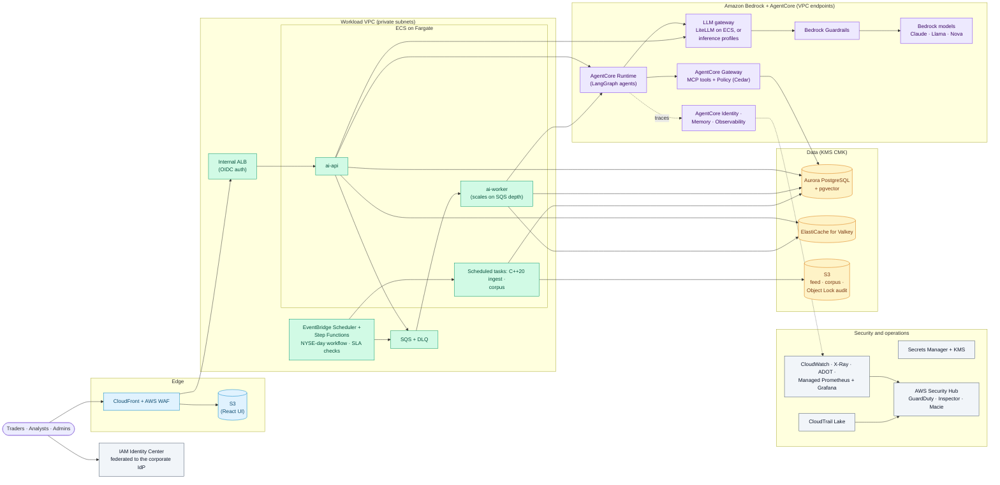

# premarket-ai on AWS

> Last reviewed: 2026-09-26. Theory only: no resources, no cost. The cloud-neutral design is in `reference-architecture.md`; the full component table is in `service-mapping.md`.

## Why a firm would pick AWS
- Many banks and broker-dealers already run their core workloads on AWS, with a mature multi-account landing zone and security tooling.
- **Amazon Bedrock** offers Claude, Llama, Amazon Nova and other models under AWS's enterprise terms, with Guardrails, Knowledge Bases and Evaluations in the same service.
- **Bedrock AgentCore** hosts agents built with *any* framework, LangGraph included, and adds Gateway (APIs as MCP tools), Identity, Memory, Policy, Observability and Evaluations: the lab's agents move almost unchanged.

## Architecture

## Component choices

| Layer | Choice | Notes |
|---|---|---|
| Models | **Amazon Bedrock**: a Claude model for the brief and judge escalation; a small model (for example Nova Lite or a small Llama) for extraction and summaries | Cross-region inference profiles for resilience; provisioned throughput for the morning peak if needed; application inference profiles tag cost per team |
| Open-weight models | **SageMaker AI** endpoints, or Bedrock's own open-weight models | Only if the firm keeps the lab's local-model path |
| Gateway | Keep **LiteLLM** on ECS in front of Bedrock (quotas, fallbacks, aliases, spend), or call Bedrock directly with inference profiles | AWS has no single first-party equivalent of APIM's or Apigee's AI gateway |
| Agents | **AgentCore Runtime** hosting the lab's LangGraph graphs (session isolation, long runs) | **Bedrock Agents is now Bedrock Agents Classic**, closed to new customers since 2026-07-30: new work goes to AgentCore. Strands Agents is AWS's open-source framework |
| Tools | **AgentCore Gateway** in front of the MCP server (or turning internal APIs and Lambda functions into MCP tools directly) | **AgentCore Policy** (Cedar) enforces per-agent tool allowlists outside the agent's code |
| Agent identity | **AgentCore Identity** | Replaces the shared MCP service token; supports on-behalf-of access to other systems |
| Memory | **AgentCore Memory**, or keep the LangGraph store in Aurora | The watchlist is small; keeping it in Aurora keeps it next to the rest of the data |
| Guardrails | **Bedrock Guardrails**: content filters, prompt-attack filter, denied topics ("investment advice"), PII redaction, contextual grounding checks, Automated Reasoning checks | The lab's domain rules stay in code; Guardrails can also be called from AgentCore Policy |
| RAG | pgvector on **Aurora PostgreSQL**; **Bedrock Knowledge Bases** with **S3 Vectors** only for a simple, very large document store | Keeps the lab's hybrid query and reranker; Bedrock rerank models can replace `bge-reranker-base` |
| Queue and schedule | **SQS** (with a dead-letter queue) + ECS workers; **EventBridge Scheduler** starts a **Step Functions** state machine for the day (waits, retries, SLA branches, `waitForTaskToken` for approvals) | The exchange-calendar logic stays in a small Lambda or task |
| Web | **S3 + CloudFront + AWS WAF** | The API behind an internal ALB, reached through CloudFront VPC origins |
| Identity | **IAM Identity Center** federated to the corporate IdP for the workforce; the app uses **Cognito** federated to the same IdP, or ALB OIDC authentication | IAM roles (ECS task roles) for every service; no static keys |
| Secrets and keys | **Secrets Manager** + **KMS** customer-managed keys | Aurora IAM authentication removes database passwords |
| Observability | **AWS Distro for OpenTelemetry** to CloudWatch and X-Ray; **AgentCore Observability** for agent traces; **Amazon Managed Service for Prometheus** + **Amazon Managed Grafana** for the lab's dashboard | The lab's OTel instrumentation carries over |
| Audit | **S3 Object Lock** in compliance mode for prompts, answers, verdicts and overrides; **CloudTrail Lake** for API activity | Object Lock compliance mode is designed for SEC 17a-4-style WORM requirements (with the firm's own attestation) |
| Security operations | **AWS Security Hub** (correlates **GuardDuty**, **Inspector**, **Macie** and **Security Hub CSPM** findings), Security Lake to the SIEM | Macie finds PII in the S3 buckets |

## Landing zone and network
- **AWS Control Tower** + **Landing Zone Accelerator**: an organization with security, log-archive and shared-services accounts; service control policies (allowed regions, deny public buckets, require KMS, allowed Bedrock models).
- **Accounts:** `premarket-dev`, `premarket-test`, `premarket-prod`, plus a shared `ai-platform` account for the gateway and Bedrock model access.
- **VPC endpoints (PrivateLink)** for Bedrock, AgentCore, Secrets Manager, S3, SQS and CloudWatch; no NAT path to the model APIs.
- **AWS Network Firewall** with a domain allowlist for SEC EDGAR, market data and approved search APIs.

## MLOps on AWS
| Stage | AWS service |
|---|---|
| Datasets and golden sets | S3 (versioned buckets), SageMaker Catalog for discovery and lineage |
| Prompt and agent versions | Git; AgentCore Runtime versions and endpoints deployed by pipeline |
| Offline evaluation | The lab's eval gates in CI, plus **Bedrock Evaluations** (models and RAG, LLM-as-judge) and **AgentCore Evaluations** (agents) |
| Classic ML (DistilBERT) | **SageMaker AI** Pipelines, Model Registry (approval status), endpoints |
| Release | GitHub Actions or CodePipeline; ECS blue/green deployments; AgentCore endpoint versions for canaries |
| Online monitoring | CloudWatch, AgentCore Observability, SageMaker Model Monitor for the classic model |
| Governance | Model Registry approval states plus the firm's MRM inventory |

## Cost drivers (qualitative)
- Fixed: Aurora (Multi-AZ), ElastiCache, NAT and VPC endpoints, Network Firewall, WAF, CloudWatch logs and Security Hub.
- Variable: Bedrock tokens (small at 100 items a day), AgentCore Runtime seconds, Fargate tasks, S3.
- As on every cloud, network security and logging cost more than the tokens for this workload.

## What changes in the lab's code
- **Nothing in the business logic.** LiteLLM already supports Bedrock; the aliases point to Bedrock models.
- Package each LangGraph graph for AgentCore Runtime (its SDK wraps an existing graph) or keep them in the ECS worker.
- Replace the JWT login with OIDC from Cognito or the ALB; map groups to TRADER / ANALYST / ADMIN.
- Use IAM authentication for Aurora and ElastiCache; read other secrets from Secrets Manager.
- Swap taskiq's Redis Stream for SQS (or keep Redis Streams on ElastiCache).
- Write the audit rows to an Object Lock bucket as well.

## Caveats (as of 2026-09-26)
- **Bedrock Agents Classic** is in maintenance mode and closed to new customers; don't start new designs on it.
- The original Security Hub is now **Security Hub CSPM**; the new **AWS Security Hub** sits on top of it.
- A2A is supported in AgentCore Runtime; AWS says broader A2A support across AgentCore is still coming.
