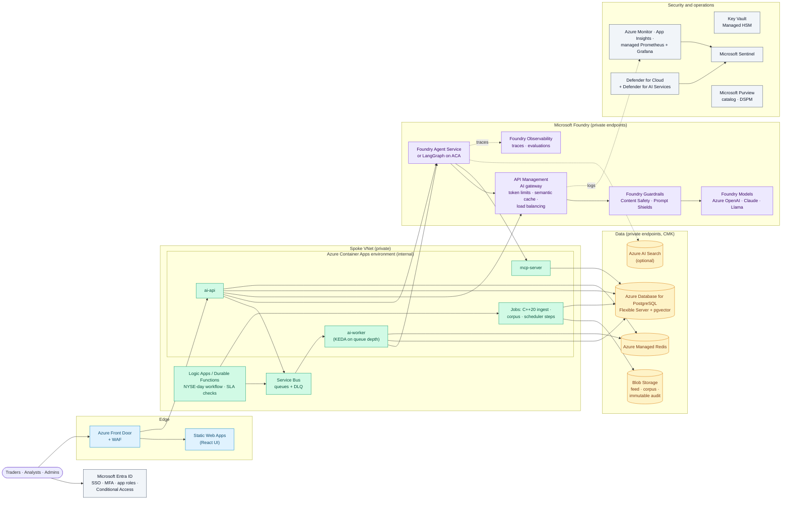

# premarket-ai on Azure

> Last reviewed: 2026-09-26. Theory only: no resources, no cost. The cloud-neutral design is in `reference-architecture.md`; the full component table is in `service-mapping.md`.

## Why a firm would pick Azure
- The firm already runs **Microsoft Entra ID**, Microsoft 365 and Microsoft Sentinel: identity, Conditional Access and the SIEM are already in place.
- **Microsoft Foundry** (formerly Azure AI Foundry) offers OpenAI models under Azure's enterprise terms, next to Claude, Llama and other models, with one place for agents, guardrails, evaluations and tracing.
- **API Management's AI gateway** gives token quotas, semantic caching and failover across model deployments, which replaces LiteLLM with a governed, supported service.

## Architecture

## Component choices

| Layer | Choice | Notes |
|---|---|---|
| Models | **Foundry Models**: an Azure OpenAI deployment for the brief and judge escalation; a small model for extraction and summaries | Data zone or regional deployments keep processing in the chosen geography; provisioned throughput for the 06:00–07:30 peak if needed |
| Open-weight models | Foundry managed compute, or Container Apps **serverless GPUs** for Llama Guard and a small local-class model | Only if the firm wants the lab's local-model path; otherwise Foundry Guardrails replace Llama Guard |
| Gateway | **API Management AI gateway** | `llm-token-limit` per consumer (team budgets), `llm-semantic-cache-lookup/store` backed by Azure Managed Redis, backend pools with circuit breakers across two regions. A dedicated AI Gateway tier is in public preview |
| Agents | Keep **LangGraph** in Container Apps (the verify graph's interrupts and Postgres checkpoints carry over), or move the chat specialists to **Foundry Agent Service** | Microsoft Agent Framework 1.0 is the Microsoft-native framework if the firm standardizes on it |
| Tools | Keep `mcp-server` in Container Apps behind **APIM** (MCP passthrough with authentication and rate limits) | APIM can also expose existing REST APIs as MCP servers |
| Agent identity | **Microsoft Entra Agent ID** for each agent | Replaces the shared MCP service token |
| Guardrails | **Guardrails in Microsoft Foundry**: harmful content, Prompt Shields for user prompts and documents, PII, task adherence | The lab's domain rules (no advice, verdict policy, citations) stay in code |
| RAG | pgvector on **Azure Database for PostgreSQL** (with `pg_diskann` for larger indexes); **Azure AI Search** only if the corpus grows to millions of documents | Keeps the lab's one-SQL hybrid query |
| Queue and schedule | **Service Bus** + Container Apps jobs; **Logic Apps** or **Durable Functions** run the day's steps with the exchange calendar | Durable Functions give code-first orchestration with timers and retries |
| Web | **Static Web Apps** or Blob static website behind **Front Door + WAF** | Private link from Front Door to the internal Container Apps ingress |
| Identity | **Entra ID** app registration with app roles `Trader`, `Analyst`, `Admin`; managed identities for every service | No passwords in the database any more |
| Secrets and keys | **Key Vault** (Managed HSM for CMK) | CMK on PostgreSQL, Storage, Redis and Foundry |
| Observability | **Application Insights** via the Azure Monitor OpenTelemetry Distro, **Foundry Observability** for traces and evaluations, managed Prometheus + Azure Managed Grafana for the existing dashboard | The lab's OTel instrumentation carries over |
| Audit | **Blob immutable storage** (locked time-based retention) for prompts, answers, verdicts and overrides | Meets WORM recordkeeping requirements when configured and attested |
| Security operations | **Defender for Cloud** with the **Defender for AI Services** plan, **Microsoft Sentinel**, **Purview** DSPM | Defender alerts on jailbreaks and data leakage in Foundry workloads |

## Landing zone and network
- **Azure landing zones** (Cloud Adoption Framework): management groups, Azure Policy (allowed regions, deny public network access, require CMK, allowed Foundry models).
- **Hub-and-spoke:** Azure Firewall in the hub with an egress allowlist (SEC EDGAR, approved market-data and search endpoints); the application in a spoke.
- **Private endpoints** for Foundry, APIM (internal mode), PostgreSQL, Managed Redis, Storage, Key Vault and AI Search; private DNS zones in the hub.
- **Subscriptions:** `premarket-dev`, `premarket-test`, `premarket-prod`, plus shared `connectivity`, `management` (logs) and `ai-platform` (APIM + Foundry shared by other teams).

## MLOps on Azure
| Stage | Azure service |
|---|---|
| Datasets and golden sets | Blob Storage + Azure Machine Learning data assets |
| Prompt and agent versions | Git + Foundry projects; agents deployed by pipeline |
| Offline evaluation | The lab's eval gates in CI, plus **Foundry evaluations** (groundedness, relevance, safety, agent metrics) |
| Classic ML (DistilBERT) | Azure Machine Learning pipelines, registry, managed online endpoints |
| Release | GitHub Actions or Azure DevOps with environment approvals; Container Apps revisions with traffic splitting (canary) |
| Online monitoring | Foundry Observability, Application Insights, Azure Monitor alerts |
| Governance | Model inventory and approval records outside the platform (the firm's MRM tool); Purview for data lineage |

## Cost drivers (qualitative)
- Fixed: APIM (tier-dependent), Front Door + WAF, PostgreSQL Flexible Server (zone-redundant HA), Managed Redis, Azure Firewall, Log Analytics / Sentinel ingestion.
- Variable: Foundry model tokens (small at 100 items a day), Container Apps consumption, serverless GPU seconds if used.
- The tokens are the smallest line; logging and network security are usually the largest.

## What changes in the lab's code
- **Nothing in the business logic.** The gateway already speaks the OpenAI API; the model aliases point at APIM instead of LiteLLM.
- Replace the JWT login with Entra ID (OIDC) and map app roles to TRADER / ANALYST / ADMIN.
- Use managed identity for PostgreSQL, Redis, Storage and the gateway instead of passwords.
- Swap taskiq's Redis Stream for Service Bus (or keep Redis Streams on Azure Managed Redis).
- Send the audit rows to immutable Blob Storage as well as the database.

## Caveats (as of 2026-09-26)
- APIM's dedicated **AI Gateway tier** is in public preview in a few regions.
- Azure AI Search's agentic retrieval is GA in the REST API, while its portal and Foundry experiences are still in preview.
- Azure Cache for Redis tiers are being retired (Enterprise on 2027-03-31, Basic/Standard/Premium on 2028-09-30); use Azure Managed Redis.
- Microsoft is moving agent security for Foundry to Microsoft Agent 365; check which product carries the controls at design time.
