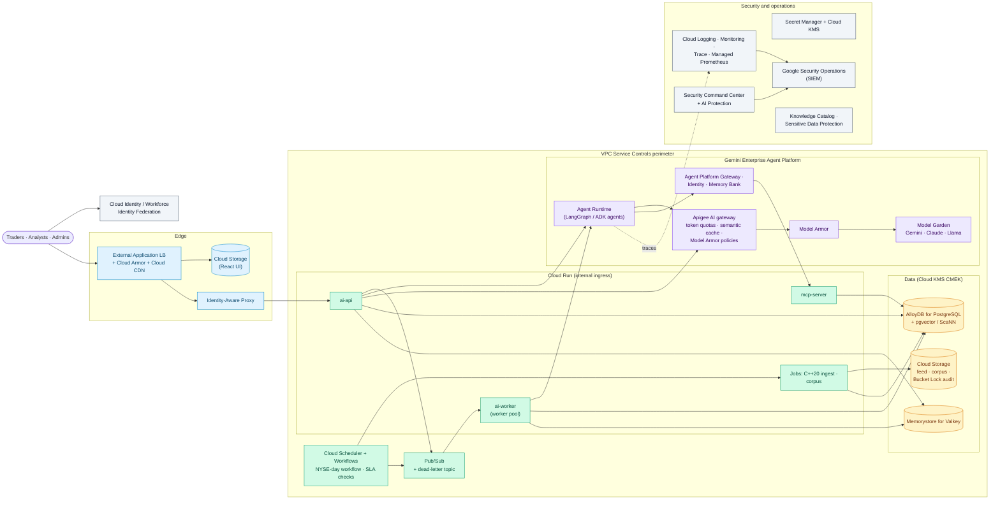

# premarket-ai on GCP

> Last reviewed: 2026-09-26. Theory only: no resources, no cost. The cloud-neutral design is in `reference-architecture.md`; the full component table is in `service-mapping.md`.

> **Naming:** on 2026-04-22 Google renamed **Vertex AI** to **Gemini Enterprise Agent Platform** ("Agent Platform"), and many product names changed with it (Agent Engine → Agent Runtime, Vertex AI Search → Agent Search, Vector Search 2.0 → Agent Retrieval, the Gen AI evaluation service → Agent Platform Evals). Older documents, courses and SDKs still say "Vertex AI". **Gemini Enterprise** on its own (formerly Agentspace) is the workplace app for employees, not the developer platform.

## Why a firm would pick GCP
- **Gemini models** with Google's enterprise terms, plus Claude and Llama from the same Model Garden.
- **Agent Runtime** hosts LangGraph and ADK agents, and Google started A2A, so agent interoperability is well supported.
- Strong data and analytics (BigQuery, AlloyDB AI) and **VPC Service Controls**, which put a data-exfiltration perimeter around managed services.

## Architecture

## Component choices

| Layer | Choice | Notes |
|---|---|---|
| Models | **Model Garden on Agent Platform**: a Gemini Pro-class model for the brief and judge escalation, a Flash-class model for extraction and summaries; Claude available as an alternative | Regional endpoints for data residency; provisioned throughput for the morning peak if needed |
| Open-weight models | **Cloud Run GPUs** or GKE for Llama Guard and small models; Model Garden self-deployed endpoints | Only if the firm keeps the lab's local-model path |
| Gateway | **Apigee** AI policies: `LLMTokenQuota`, prompt-token rate limits, semantic cache, Model Armor sanitize policies | Or keep LiteLLM on Cloud Run behind Apigee |
| Agents | **Agent Runtime** hosting the lab's LangGraph graphs (formerly Agent Engine) | ADK 2.0 (with graph workflows) is Google's framework if the firm standardizes on it |
| Tools | Keep `mcp-server` on Cloud Run behind **Agent Platform Gateway** / Apigee | ADK agents consume MCP tools natively |
| Agent identity and memory | **Agent Platform Identity**; **Memory Bank** / Sessions, or keep the LangGraph store in AlloyDB | Replaces the shared MCP service token |
| Guardrails | **Model Armor** (prompt injection, jailbreak, sensitive data, malicious URLs, harmful content), enforced at Apigee or called from the app | Part of Security Command Center **AI Protection**; the lab's domain rules stay in code |
| RAG | pgvector (or the ScaNN index) on **AlloyDB AI**; **RAG Engine** or **Agent Search** only for simple, large document stores | Keeps the lab's hybrid query; Agent Search's ranking API can replace the reranker |
| Queue and schedule | **Pub/Sub** + Cloud Run worker pools; **Cloud Scheduler** starts a **Workflows** execution for the day (waits, retries, callbacks for approvals) | The exchange-calendar logic stays in a small Cloud Run service |
| Web | **Cloud Storage + Cloud CDN** behind the external Application Load Balancer with **Cloud Armor** | **IAP** in front of the API adds identity checks at the edge |
| Identity | **Cloud Identity** or **Workforce Identity Federation** with the corporate IdP; **IAP** for the app; service accounts with **Workload Identity Federation** for CI | No service-account keys |
| Secrets and keys | **Secret Manager** + **Cloud KMS** (Cloud HSM) CMEK | AlloyDB IAM authentication removes database passwords |
| Observability | OpenTelemetry to **Cloud Trace**, **Cloud Monitoring** and **Google Cloud Managed Service for Prometheus**; Agent Runtime traces | The lab's OTel instrumentation carries over |
| Audit | **Cloud Storage Bucket Lock** (locked retention policy) for prompts, answers, verdicts and overrides; Cloud Audit Logs to locked log buckets | WORM with the firm's own attestation |
| Security operations | **Security Command Center** (Premium, with AI Protection), **Google Security Operations** as SIEM, **Sensitive Data Protection** for PII, **Knowledge Catalog** (formerly Dataplex Universal Catalog) for lineage | |

## Landing zone and network
- **Enterprise foundations blueprint** (Terraform): an organization with folders per environment, organization policies (allowed regions, no external IPs, CMEK required, restrict Model Garden models).
- **Projects:** `premarket-dev`, `premarket-test`, `premarket-prod`, plus shared `network-host` (Shared VPC), `logging`, `security` and `ai-platform`.
- **VPC Service Controls** perimeter around Agent Platform, AlloyDB, Cloud Storage, Secret Manager and Pub/Sub; **Private Service Connect** for private access to Google APIs.
- **Cloud NGFW** and Secure Web Proxy for an egress allowlist (SEC EDGAR, market data, approved search).

## MLOps on GCP
| Stage | GCP service |
|---|---|
| Datasets and golden sets | Cloud Storage, BigQuery; lineage in Knowledge Catalog |
| Prompt and agent versions | Git; Agent Studio for experiments; Agent Runtime deployments by pipeline |
| Offline evaluation | The lab's eval gates in CI, plus **Gemini Enterprise Agent Platform Evals** (model, RAG and agent metrics) |
| Classic ML (DistilBERT) | **Agent Platform Pipelines**, **Model Registry on Agent Platform**, endpoints |
| Release | Cloud Build + Cloud Deploy (canary on Cloud Run with traffic splitting), or GitHub Actions with Workload Identity Federation |
| Online monitoring | Cloud Monitoring, Cloud Trace, model monitoring for the classic model |
| Governance | Model Registry versions and aliases plus the firm's MRM inventory |

## Cost drivers (qualitative)
- Fixed: AlloyDB (HA), Memorystore, the load balancer with Cloud Armor, Apigee (its own pricing model), Cloud NGFW, logging and Security Command Center Premium.
- Variable: model tokens (small at 100 items a day), Agent Runtime, Cloud Run and GPU seconds if used.
- Network security, Apigee and logging dominate over the tokens for this workload.

## What changes in the lab's code
- **Nothing in the business logic.** LiteLLM already supports Gemini and Model Garden; the aliases point to them (or to Apigee).
- Deploy the LangGraph graphs to Agent Runtime (it wraps an existing graph), or keep them in the Cloud Run worker.
- Replace the JWT login with IAP headers or OIDC; map groups to TRADER / ANALYST / ADMIN.
- Use IAM authentication for AlloyDB; read other secrets from Secret Manager.
- Swap taskiq's Redis Stream for Pub/Sub (or keep Redis Streams on Memorystore).
- Write the audit rows to a Bucket Lock bucket as well.

## Caveats (as of 2026-09-26)
- The Agent Platform rename is recent: SDKs, APIs, IAM roles and many docs still use `vertex` / `aiplatform` names. Check each component's GA or preview status at design time; Google's launch post doesn't list it per component.
- **Dataplex** APIs, CLI commands and IAM names are unchanged under the new Knowledge Catalog name.
