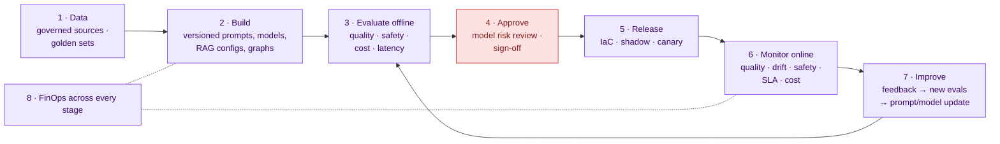

# MLOps and LLMOps in an enterprise

> Last reviewed: 2026-09-26. Theory only. Each stage says what an enterprise does and **what the lab does, or doesn't do**. Cloud product names are in `service-mapping.md`.

**Lab status legend:** ✅ the lab does it · 🟡 partly, or a simpler version · ❌ not in the lab (the reason is given)

## MLOps vs LLMOps
- **MLOps** manages models you **train**: datasets, features, training runs, a model registry, deployment, drift and retraining.
- **LLMOps** manages applications built on models you mostly **don't train**: prompts, model versions behind aliases, RAG indexes, agent graphs, tools, evals, guardrails, tracing and token cost.

premarket-ai has both: the DistilBERT verdict classifier is classic MLOps; everything around the LLM judge, RAG and the agents is LLMOps. In an enterprise both run on the same governed lifecycle.

## The lifecycle

## 1. Data

| Enterprise practice | Lab status | Lab equivalent / reason |
|---|---|---|
| Governed, cataloged sources with owners and lineage | 🟡 | Trusted corpus only from SEC EDGAR and the Fed; vendor feed kept separate; no catalog |
| Data quality checks on ingestion | ✅ | The C++ ingesters validate and flag duplicates; the rules engine checks every item |
| Versioned datasets (training, golden sets, feedback) | 🟡 | Golden set generated deterministically from seed 42 with `labels.jsonl`; not in a dataset registry |
| Train/test separation enforced | ✅ | DistilBERT never trains on the golden set's seed |
| PII handling and consent | ✅ | Synthetic data only; PII masking before model calls |
| Human feedback captured as labeled data | ✅ | Every analyst override becomes an `ai.eval_example` |

## 2. Build: everything is a versioned artifact

| Artifact | Enterprise practice | Lab status | Lab equivalent / reason |
|---|---|---|---|
| Prompts | Prompt registry with versions, owners and linked eval results | 🟡 | Prompts versioned in git with the code; no separate registry |
| Model versions | Model registry; aliases point to approved versions only | 🟡 | LiteLLM task aliases pinned in config, changed by PR |
| Trained models | Registered with training data version, metrics, lineage | ❌ | `ml-train` writes the model to a volume; no registry |
| RAG configuration | Chunking, embedding model, index settings versioned; reindex is a controlled change | ✅ | A different embedding size is refused until `reindex`; `migrate-vectors` compares top-k before switching |
| Agent graphs, tools, skills | Versioned and reviewed like code; tool catalog | ✅ | LangGraph code, MCP tools and `SKILL.md` folders in git |
| Experiment tracking | Every run's parameters and metrics recorded | 🟡 | Benchmark and eval reports written to `docs/benchmarks/`; no tracking server |

## 3. Evaluate offline

| Eval type | Enterprise practice | Lab status | Lab equivalent / reason |
|---|---|---|---|
| Task quality | Golden set with thresholds per metric | ✅ | Verdicts: FAKE recall ≥ 0.85, precision ≥ 0.90, macro-F1 ≥ 0.75, 4×4 confusion matrix |
| RAG quality | Faithfulness, context precision/recall, citation accuracy | ✅ | RAGAS faithfulness and context precision, citation checks (`eval-rag`) |
| Safety and security | Red-team suites: injection, jailbreak, exfiltration, harmful content | ✅ | Every injection item flagged, no tool called with injected text, advice refusals |
| Regression | Compare with the approved baseline; block regressions | ✅ | No metric more than 2 points below the stored baselines |
| Bias and fairness | Checks across relevant groups | ❌ | Not meaningful for news verification of synthetic items |
| Cost and latency | Budget per request, p95 latency targets | 🟡 | `bench-models` measures latency per model; cost tracked, not gated |
| Model comparison | Same eval across candidate models and providers | ✅ | Rules-only vs hybrid vs DistilBERT; the eval can run with each provider |
| Human evaluation | Expert review of samples | 🟡 | The analysts' review queue, in production rather than offline |

## 4. Approve (model risk management)

| Enterprise practice | Lab status | Lab equivalent / reason |
|---|---|---|
| Model inventory entry (owner, purpose, tier, dependencies, vendor models) | ❌ | Single-owner lab |
| Model card and validation report | ❌ | The eval reports hold most of the content a model card would |
| Independent validation (a team that didn't build it) | ❌ | Needs a second team |
| Sign-off by the model risk / AI governance committee | ❌ | The PR review and eval gate are the only approval |
| Periodic re-validation (yearly, or on material change) | ❌ | — |
| Third-party (vendor model) risk assessment | ❌ | The cloud model is optional and budget-capped |

This is the biggest gap between a lab and a bank: the technical controls exist, the **governance process** doesn't.

## 5. Release safely

| Enterprise practice | Lab status | Lab equivalent / reason |
|---|---|---|
| Infrastructure as code for every environment | 🟡 | `compose.yaml` and the Containerfiles describe everything; one environment |
| CI with required gates (tests, lint, evals, security scans) | ✅ | Hosted CI plus the protected self-hosted GPU eval runner |
| **Shadow mode** for a new model or prompt | 🟡 | The brief ran in parallel with the PDF; the C++20 ingester ran in parallel with the legacy one (zero parity differences) |
| Canary / blue-green releases | ❌ | One PC, one environment |
| Feature flags and kill switches | ✅ | Cloud switches (master, judge, brief), `LEGACY_PDF_ENABLED`, `LEGACY_INGEST`, `GUARD_NEWS_REVIEW` |
| Rollback plan | 🟡 | Git tags per increment; the legacy profile can be brought back |

## 6. Monitor online

| Signal | Enterprise practice | Lab status | Lab equivalent / reason |
|---|---|---|---|
| Service health and SLAs | Dashboards and alerts on business deadlines | ✅ | SLA checks at 06:15, 06:30, 07:00, 07:30; alerts to the UI banner |
| LLM traces | Every request's prompt, context, tools, tokens, latency | ✅ | Langfuse |
| GenAI metrics | Token usage and latency per model, errors | ✅ | OpenTelemetry GenAI semantic conventions to Prometheus and Grafana |
| Quality in production | User feedback, override rate, online LLM-as-judge on samples | 🟡 | Analyst overrides per day in the vendor scorecard; no online judge |
| Drift | Input distribution, embedding drift, verdict mix over time | 🟡 | The scorecard's 30-day trend of verdicts; no statistical drift test |
| Safety incidents | Injection and jailbreak detections, blocked outputs | 🟡 | Injection items counted per day; no incident workflow |
| Cost | Spend per team, app and model | ✅ | Monthly cloud budget with 80% and 100% alerts, cost per day in the scorecard |

## 7. Improve

| Enterprise practice | Lab status | Lab equivalent / reason |
|---|---|---|
| Feedback loop from reviewers into eval and training data | ✅ | Overrides become labeled examples; a change to FAKE lowers the source's reputation |
| Scheduled retraining of classic models | ❌ | `ml-train` is run by hand |
| Prompt and model updates only through the full lifecycle | 🟡 | Through PR and eval gate; no approval step |
| Fine-tuning LLMs when prompting and RAG aren't enough | ❌ | Not needed: rules and RAG already meet the gates |

## 8. FinOps for AI

| Enterprise practice | Lab status | Lab equivalent / reason |
|---|---|---|
| Token budgets per team or application; chargeback | 🟡 | One monthly budget (`LLM_MONTHLY_BUDGET_USD`, default $20) |
| Provisioned vs on-demand capacity decisions | ❌ | Pay per token only |
| Route by task: small or local models for easy tasks, large ones for hard | ✅ | Local 3–4B models for most tasks; cloud only for the brief and optional judge escalation |
| Caching (prompt caching, semantic cache) | ✅ | Semantic answer cache; MCP tool cache in Redis |
| Batch inference for non-interactive work | ✅ | Enrichment and verification run as batch jobs before the open |
| Degrade gracefully at the cap | ✅ | "Cloud budget reached, running local" |

## Roles in an enterprise AI lifecycle

| Role | Owns |
|---|---|
| **AI engineers** | Prompts, RAG, agents, tools, guardrails, application evals (see `ai-engineer-vs-ml-engineer.md`) |
| **ML engineers** | Classic models, fine-tuning, training pipelines, model serving |
| **ML / AI platform team** | The AI gateway, model deployments, agent runtime, registries, shared eval tooling |
| **Data engineers and data governance** | Sources, quality, lineage, classification |
| **Model risk management** | Inventory, independent validation, approval, periodic review |
| **Security** | Threat modeling, red teaming, SIEM rules, incident response |
| **Business owners (the trading desk)** | Acceptance criteria, reviewing verdicts, deciding what "good enough" means |
