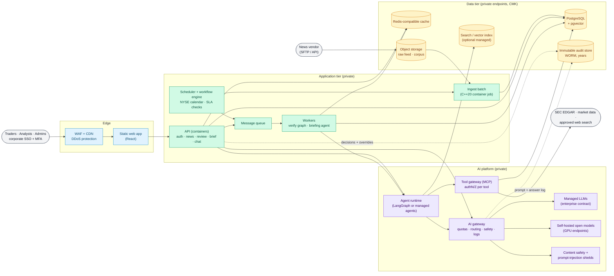
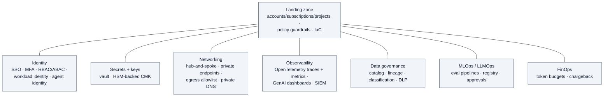
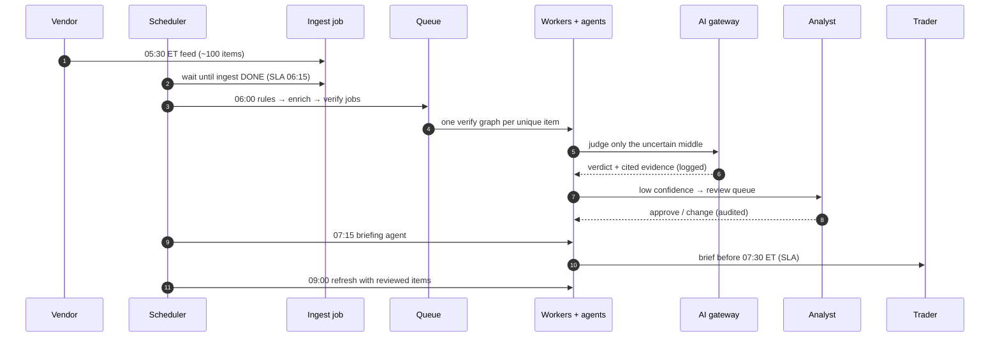

# Enterprise reference architecture (cloud-neutral)

> Last reviewed: 2026-09-26. Theory only: nothing here is deployed and nothing costs money. Provider-specific versions: `azure.md`, `aws.md`, `gcp.md`.

## Purpose
This page describes how a **large regulated firm** (a bank, broker-dealer or asset manager) would build premarket-ai in production, without naming any cloud. The same building blocks appear on every hyperscaler; the provider pages only swap in the product names.

The business problem is unchanged: every trading day, a vendor sends about 100 news items, some duplicated, stale, misleading or fake. By 07:30 ET traders need a brief built only from verified stories, with evidence, and analysts must be able to review the uncertain ones.

## Design principles
1. **Private by default.** No model, database or cache has a public endpoint. Users reach the web tier through a WAF; everything else talks over private networking.
2. **Identity everywhere, keys nowhere.** People sign in with corporate SSO and MFA. Services use **workload identities** (managed identities, IAM roles, service accounts), never API keys in code or `.env` files.
3. **One door to the models.** Every model call goes through an **AI gateway** that enforces quotas, routing, content safety, logging and chargeback.
4. **Code decides what matters; models decide the uncertain middle.** The lab's rule (hard rules for FAKE, the judge only between VERIFIED, UNVERIFIED and MISLEADING, humans for low confidence) is exactly what model risk teams want to see.
5. **Least agency.** Agents get read-only tools from an allowlist, through a governed tool gateway. Any write action needs a human.
6. **Everything is recorded.** Prompts, retrieved context, tool calls, answers, verdicts and overrides go to an immutable audit store for years.
7. **Open standards at the seams.** OpenAI-compatible model APIs, MCP for tools, A2A between agents, OpenTelemetry for telemetry, SQL + pgvector for data. The lab's code maps onto the cloud version without a rewrite of its logic.
8. **Everything as code.** Landing zone, networks, services, policies, prompts, eval sets and dashboards are versioned and deployed by pipelines with approvals.

## Logical architecture

### Cross-cutting services

## Building blocks

| Block | What it does in the enterprise | Lab equivalent |
|---|---|---|
| **WAF + CDN** | TLS termination, bot and DDoS protection, OWASP rules, geo and rate limits in front of the web tier | nginx edge proxy with security headers and rate limits |
| **Static web app** | The React UI from object storage behind the CDN | `web-1` / `web-2` behind the edge |
| **API (containers)** | Stateless FastAPI on a managed container platform or Kubernetes, autoscaled, private | `ai-api` in Podman |
| **Message queue + workers** | Durable queue, dead-letter queue, autoscaled workers per queue depth | taskiq on a Redis Stream, `ai-worker` |
| **Scheduler + workflow engine** | Cron on the exchange calendar, retries, timeouts, SLA alarms, a visual run history | APScheduler + `exchange_calendars`, SLA checks to a Redis Stream |
| **Ingest batch** | The C++20 ingester as a container job reading the vendor drop from object storage | `ingest` container with supercronic |
| **AI gateway** | One endpoint for every model: auth by workload identity, token quotas per team, load balancing and failover across regions, semantic cache, content safety, logging, chargeback | LiteLLM with task aliases and a monthly budget |
| **Managed LLMs** | Frontier models under an enterprise contract: no training on customer data, regional processing, provisioned throughput | `cloud-openai` alias through an API key |
| **Self-hosted open models** | Open-weight models on private GPU endpoints for cost, latency or data-sensitivity reasons | Ollama on the GPU host |
| **Content safety** | Managed classifiers for harmful content, prompt injection (direct and indirect) and data leakage, on input and output | Llama Guard 3 plus the lab's sanitize, spotlighting and output checks |
| **Agent runtime** | Hosts agent graphs with session isolation, memory, identity and tracing; either managed agents or LangGraph in containers | LangGraph in `ai-api` / `ai-worker`, Postgres checkpoints and store |
| **Tool gateway (MCP)** | Publishes internal APIs as MCP tools with authentication, per-agent authorization, rate limits and audit | `mcp-server` with a service token and read-only tools |
| **PostgreSQL + pgvector** | Managed, zone-redundant PostgreSQL with private endpoint, CMK, PITR backups, read replicas; pgvector for hybrid search | PostgreSQL 17 + pgvector in a container |
| **Managed search index** | Optional: a managed search service for large corpora, semantic ranking and document-level security | Not needed at 5,000 chunks |
| **Redis-compatible cache** | Sessions, dedup index, rate limits, semantic cache, locks | Redis 8 + RedisVL |
| **Object storage** | The raw vendor feed, the trusted corpus, eval datasets, with lifecycle rules | Container volumes |
| **Immutable audit store** | WORM retention of prompts, answers, verdicts, overrides and brief views for the regulatory period | Audit tables, 90 days (a documented simplification) |
| **Observability + SIEM** | OpenTelemetry traces and GenAI metrics into the cloud monitor and a Langfuse-like LLM tracer; security events into the SIEM | Langfuse, OpenTelemetry Collector, Prometheus, Grafana |

## How a trading day flows

## Environments and delivery
- **Accounts / subscriptions / projects:** separate `dev`, `test` and `prod`, plus shared `network`, `security` (logs, SIEM) and `ai-platform` (gateway, model deployments) units under a landing zone with policy guardrails (allowed regions, no public IPs, encryption required, approved model list).
- **Pipelines:** infrastructure as code (Terraform, Bicep or CDK), container images signed and scanned, the eval suite as a required gate, and a change approval for production.
- **Release:** canary or blue-green for the API and workers; **shadow mode** for a new model or prompt (it runs on real items without affecting verdicts, and its results are compared before the switch).
- **Resilience:** zone-redundant data services, a second region for the AI gateway's failover, documented RTO/RPO, and a "rules-only" degraded mode when every model is unavailable (the lab already falls back to local models and deterministic overviews).

## What changes from the lab, and what doesn't
**Changes:** managed services instead of containers for state (database, cache, queue), corporate identity instead of seeded users, private networking, WORM audit, model risk approval, multi-environment delivery.

**Stays the same:** the verify workflow and its verdict policy, the rules engine, the prompts and schemas, RAG with hybrid search, the MCP tools, the skills, the eval sets and gates, and the OpenTelemetry instrumentation. That is the benefit of building the lab on open standards.

## Related pages
- `service-mapping.md`: every lab component and its Azure, AWS and GCP service
- `security.md`: enterprise controls vs the lab
- `mlops-llmops.md`: lifecycle, evaluation, approval and monitoring
- `build-vs-buy.md`: when a managed service beats the open-source stack
